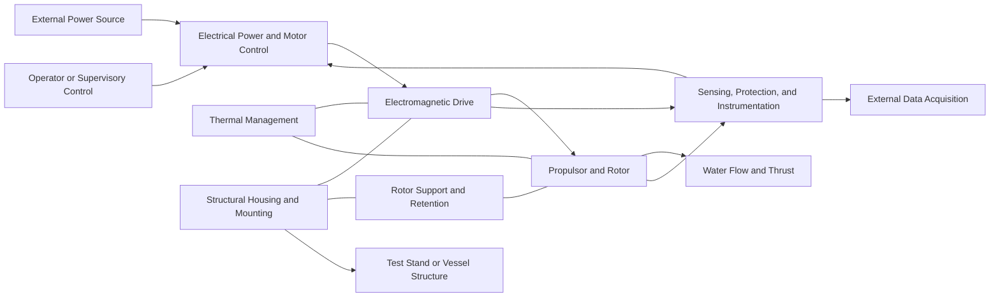

# PT-SA-001 — System Architecture

## Document Control

| Field                      | Value                                   |
| -------------------------- | --------------------------------------- |
| Project                    | Project Triton                          |
| Document ID                | PT-SA-001                               |
| Document Title             | System Architecture                     |
| Version                    | 1.0                                     |
| Status                     | Approved — DR-002 Architecture Baseline |
| Owner                      | Robert Schneider                        |
| Created                    | 2026-08-01                              |
| Last Updated               | 2026-08-11                              |
| Architecture Baseline Date | 2026-08-11                              |

## Revision History

| Version | Date       | Author           | Description                                                                                                     |
| ------- | ---------- | ---------------- | --------------------------------------------------------------------------------------------------------------- |
| 0.1     | 2026-08-01 | Robert Schneider | Initial document structure                                                                                      |
| 0.2     | 2026-08-01 | Robert Schneider | Completed the system architecture and prepared the document for DR-002 review                                   |
| 0.3     | 2026-08-11 | Robert Schneider | Corrected the Section 1 approval-status language during internal consistency review                             |
| 0.4     | 2026-08-11 | Robert Schneider | Applied DR-002 Minor Finding corrections to document control and supporting-artifact status                     |
| 1.0     | 2026-08-11 | Robert Schneider | Established the approved DR-002 system-architecture baseline; technical architecture unchanged from Version 0.4 |

## 1. Purpose

This document defines the system-level architecture for the Project Triton rim-driven thruster before detailed mechanical, electrical, or manufacturing design begins.

The architecture establishes:

* The system boundary and external interfaces.
* The principal subsystems and their responsibilities.
* The intended flow of energy, forces, cooling water, control signals, and measurement data.
* The modular interfaces required to support component replacement and controlled design evolution.
* The initial architectural constraints for the RDT-80 prototype.

This document defines the proposed structural framework for subsequent requirements development, interface definition, analysis, CAD modeling, prototyping, and testing. The framework shall not be treated as approved until this architecture has been reviewed and accepted through DR-002. Preliminary CAD development may begin only after DR-002 approval and shall remain within the activities permitted by the approved review disposition.

## 2. System Scope and Boundary

### 2.1 System of Interest

The system of interest is the Project Triton RDT-80 prototype rim-driven thruster system. It includes the components and supporting equipment required to convert supplied electrical power into controlled hydrodynamic thrust and to measure prototype performance during development testing.

### 2.2 Items Within the System Boundary

The initial system boundary includes:

* Thruster structural housing and load-bearing components.
* Rotor and integrated propulsor assembly.
* Stator and electromagnetic drive components.
* Bearings, bushings, or other rotor-support features.
* Internal electrical conductors, terminations, and penetrations.
* Sealing and water-exclusion features.
* Cooling and heat-transfer provisions integral to the thruster.
* Motor-control hardware dedicated to operating the prototype.
* Sensors and instrumentation installed on or within the thruster.
* Software or firmware required for command, control, protection, and data acquisition.
* Prototype mounting and interface features necessary for controlled testing.

### 2.3 External Systems and Interfaces

The RDT-80 interfaces with systems outside the Project Triton system boundary, including:

* An external electrical power source.
* External operator controls or a supervisory control system.
* External data-recording or test-analysis equipment.
* The surrounding water or test-fluid environment.
* A test stand, vessel structure, or other thrust-reaction structure.
* External cooling equipment, when required by a specific test configuration.
* Safety systems governing emergency shutdown and test-area operation.

These external systems may impose interface requirements on the RDT-80 but are not part of the thruster design unless explicitly incorporated through a later approved architectural decision.

### 2.4 Initial Scope Limitations

DR-002 defines the architecture of the prototype and its principal interfaces. It does not establish final production geometry, materials, manufacturing tolerances, motor winding details, control algorithms, or certified marine-installation requirements.

Those details will be developed through subsequent requirements, trade studies, analyses, interface-control documents, design reviews, and prototype test results.

## 3. System Architecture Overview

### 3.1 Architectural Concept

The RDT-80 uses a modular rim-driven architecture in which electromagnetic torque is generated around the perimeter of an annular rotor. The rotor transfers this torque directly to the integrated propulsor without an axial driveshaft, gearbox, or conventional central motor.

The architecture separates the prototype into functional subsystems with controlled interfaces so that major components can be analyzed, fabricated, tested, replaced, and revised without requiring redesign of the entire system.

### 3.2 Principal Subsystems

The RDT-80 architecture consists of the following principal subsystems:

1. **Propulsor and Rotor Subsystem**
   Produces hydrodynamic thrust and transfers electromagnetic torque from the rotor rim to the propulsor blades.

2. **Electromagnetic Drive Subsystem**
   Generates the rotating electromagnetic field and applies torque to the rotor.

3. **Rotor Support and Retention Subsystem**
   Maintains the rotor’s radial and axial position while permitting controlled rotation under mechanical, electromagnetic, and hydrodynamic loads.

4. **Structural Housing and Mounting Subsystem**
   Supports the stator, rotor-support components, protective features, and external mounting interfaces while transmitting thrust and reaction loads to the test structure or vessel.

5. **Electrical Power and Motor-Control Subsystem**
   Conditions supplied electrical power, controls motor operation, and provides required switching, isolation, current limitation, and shutdown functions.

6. **Sealing and Environmental Protection Subsystem**
   Protects components and electrical interfaces that are not intended for direct water exposure while controlling leakage paths and environmental ingress.

7. **Thermal Management Subsystem**
   Transfers heat from electromagnetic, electrical, and mechanical sources to the surrounding water or another approved cooling path.

8. **Sensing, Protection, and Instrumentation Subsystem**
   Measures operating conditions, supports closed-loop control, detects unsafe conditions, and provides data required for engineering evaluation.

9. **Prototype Test Interface Subsystem**
   Provides the mechanical, electrical, control, and data interfaces required to install and operate the prototype in a controlled test configuration.

### 3.3 Functional Flow

The system performs the following top-level functional sequence:

1. The external power source supplies electrical energy to the motor-control subsystem.
2. The motor-control subsystem regulates and delivers electrical power to the electromagnetic drive subsystem.
3. The electromagnetic drive subsystem converts electrical energy into torque at the rotor rim.
4. The rotor transfers torque directly to the propulsor.
5. The propulsor imparts momentum to the surrounding water and generates thrust.
6. The rotor-support and structural subsystems react radial, axial, electromagnetic, and hydrodynamic loads.
7. The thermal-management subsystem removes generated heat.
8. The sensing and protection subsystem monitors operating conditions and initiates control or shutdown actions when required.
9. The test interface subsystem transfers commands, measurements, electrical connections, and mechanical loads between the RDT-80 and external test equipment.

### 3.4 High-Level Functional Block Diagram



The diagram represents functional relationships and energy, command, measurement, and load paths. It does not prescribe final component geometry, physical arrangement, or manufacturing method.

## 4. Architectural Drivers and Constraints

### 4.1 Architectural Drivers

The RDT-80 architecture is governed by the following primary design drivers:

1. **Direct Rim-Driven Propulsion**
   Electromagnetic torque shall be produced at the rotor perimeter and transferred directly to the propulsor without a conventional axial driveshaft or gearbox.

2. **Modular Development**
   Major subsystems shall be separable wherever practical so that alternative rotor, stator, bearing, sealing, cooling, control, and propulsor concepts can be evaluated without redesigning the complete prototype.

3. **Prototype Instrumentation**
   The prototype shall provide sufficient sensing and data access to determine electrical, mechanical, thermal, and hydrodynamic performance during controlled testing.

4. **Controlled Design Evolution**
   Interfaces between principal subsystems shall be documented and configuration-controlled so that changes can be traced, reviewed, and tested systematically.

5. **Marine Environmental Compatibility**
   Components exposed to water, moisture, galvanic couples, temperature variation, and marine contaminants shall be selected or protected for the intended prototype environment.

6. **Personnel and Equipment Safety**
   The architecture shall support electrical isolation, emergency shutdown, overspeed protection, overcurrent protection, overtemperature protection, and controlled test operation.

7. **Manufacturability and Assembly**
   The prototype shall be capable of fabrication, assembly, inspection, disassembly, and repair using methods and equipment reasonably available to the project.

8. **Scalability**
   Architectural decisions should preserve a technically credible path from the RDT-80 prototype to larger or higher-power thruster configurations without requiring the prototype to represent a production-ready design.

### 4.2 Architectural Constraints

The following constraints apply to the initial RDT-80 architecture:

| ID     | Constraint                                                                                                                                                                             |
| ------ | -------------------------------------------------------------------------------------------------------------------------------------------------------------------------------------- |
| AC-001 | The propulsor shall be driven directly through an annular rotor rather than through a central shaft or reduction gearbox.                                                              |
| AC-002 | The rotor shall have no unsupported operating mode; radial and axial position shall be maintained throughout startup, steady-state operation, shutdown, and credible fault conditions. |
| AC-003 | The structural load path shall transfer thrust, electromagnetic forces, rotor-support loads, and reaction torque to the external mounting structure.                                   |
| AC-004 | Electrical power conductors and penetrations shall be physically protected and compatible with the selected wet, dry, or encapsulated architecture.                                    |
| AC-005 | The architecture shall include a defined heat-transfer path for stator, conductor, controller, and rotor-support losses.                                                               |
| AC-006 | The prototype shall support controlled shutdown following detection of critical electrical, thermal, mechanical, or control faults.                                                    |
| AC-007 | Components expected to require inspection, adjustment, replacement, or experimental substitution shall be accessible without destructive disassembly wherever practical.               |
| AC-008 | Materials and coatings shall be evaluated for corrosion, galvanic compatibility, water absorption, erosion, fatigue, and temperature exposure appropriate to their locations.          |
| AC-009 | Rotating components shall be retained so that a single credible component failure does not result in uncontrolled rotor release.                                                       |
| AC-010 | The prototype shall provide interfaces for measuring, directly or indirectly, rotational speed, electrical input, temperature, thrust, and operating state.                            |
| AC-011 | Final voltage, current, speed, torque, thrust, and thermal limits shall be established through approved requirements and analyses before powered operation.                            |
| AC-012 | Unresolved architectural decisions shall remain explicitly identified and shall not be treated as approved design assumptions.                                                         |

### 4.3 Design Flexibility Retained at DR-002

DR-002 does not select final solutions for the following design areas:

* Wet, dry, flooded, encapsulated, or hybrid electromagnetic construction.
* Permanent-magnet configuration and retention method.
* Stator topology and winding arrangement.
* Radial and axial bearing technology.
* Rotor axial-retention method.
* Propulsor blade count, geometry, pitch, and attachment method.
* Housing material and manufacturing process.
* Primary sealing strategy.
* Passive versus actively assisted cooling.
* Motor-controller topology and operating voltage.
* Position-sensing and commutation method.
* Final test-stand configuration.

These subjects require documented trade studies, analyses, or prototype evidence before final selection.

## 5. Operating Concept and System States

### 5.1 Operating Concept

The RDT-80 prototype is intended to operate as an instrumented development system under controlled test conditions. An operator or supervisory controller provides operating commands, while the motor-control subsystem regulates electrical power to the electromagnetic drive.

During operation, the sensing and protection subsystem continuously monitors critical electrical, thermal, mechanical, and control parameters. Commands that could produce powered rotation shall be accepted only when required safety conditions and operating interlocks are satisfied.

The prototype shall transition between defined operating states rather than energizing or de-energizing through uncontrolled sequences.

### 5.2 System States

| State                         | Description                                                                                                                                                                                                                               |
| ----------------------------- | ----------------------------------------------------------------------------------------------------------------------------------------------------------------------------------------------------------------------------------------- |
| **De-Energized**              | Primary electrical power is disconnected or isolated. No commanded rotor motion is possible. Stored energy may still require verification or discharge before maintenance.                                                                |
| **Safe/Disabled**             | Control and monitoring functions may be powered, but motor output is inhibited. The system shall not produce commanded electromagnetic torque.                                                                                            |
| **Initialization**            | The control system performs startup checks, verifies communications, evaluates sensor validity, and confirms required interlocks.                                                                                                         |
| **Ready**                     | Initialization is complete, required conditions are satisfied, and the system is capable of accepting a start command. Motor torque remains inhibited until commanded.                                                                    |
| **Starting**                  | The motor-control subsystem applies a controlled startup sequence and accelerates the rotor toward the commanded operating condition.                                                                                                     |
| **Running**                   | The system produces controlled rotor motion and hydrodynamic thrust within approved operating limits.                                                                                                                                     |
| **Controlled Stop**           | Motor torque is reduced through a defined sequence to bring the rotor to a stopped or safe condition without an emergency response.                                                                                                       |
| **Fault-Limited**             | A noncritical abnormal condition has been detected. Operation may continue temporarily at reduced output or under restricted control when specifically permitted by approved protection logic.                                            |
| **Fault Shutdown**            | A critical fault has caused motor output to be inhibited and the system to transition toward a safe stopped condition.                                                                                                                    |
| **Emergency Stop**            | An emergency-stop command immediately inhibits commanded torque and initiates the approved emergency response. Electrical isolation, mechanical coast-down, and residual-energy hazards shall be addressed by the detailed safety design. |
| **Maintenance/Configuration** | The system is placed in a verified nonoperational condition for inspection, adjustment, component replacement, software loading, or configuration changes.                                                                                |

### 5.3 Nominal State Transitions

The nominal operating sequence is:

```text
De-Energized
    ↓
Safe/Disabled
    ↓
Initialization
    ↓
Ready
    ↓
Starting
    ↓
Running
    ↓
Controlled Stop
    ↓
Ready or Safe/Disabled
```

The system may transition from any powered operating state to **Fault Shutdown** or **Emergency Stop** when the applicable trigger occurs.

A return from Fault Shutdown or Emergency Stop to Ready shall require:

1. Rotor motion to have stopped or reached an explicitly approved safe condition.
2. The initiating fault or emergency condition to be identified.
3. Required inspection or corrective action to be completed.
4. Fault indications to be deliberately reset.
5. Initialization and interlock checks to be repeated.

### 5.4 Startup Preconditions

Before entering the Starting state, the architecture shall support verification of the following conditions, as applicable:

* Emergency-stop circuits are healthy and reset.
* Motor output is initially inhibited.
* Required control and sensor communications are available.
* Critical sensor readings are valid and within permitted ranges.
* The rotor is not mechanically locked, obstructed, or undergoing maintenance.
* The test article is secured to the approved mounting structure.
* The intended test-fluid condition is established.
* Required cooling provisions are operating or available.
* Electrical voltage and current limits are configured.
* Speed, torque, or power commands are within the authorized test envelope.
* Data acquisition is active when required by the test procedure.
* Personnel and test-area safety controls are satisfied.

### 5.5 Shutdown Categories

The architecture recognizes three principal shutdown categories:

1. **Controlled Stop**
   Used during normal operation. Power is reduced according to a controlled deceleration or coast-down sequence.

2. **Protective Fault Shutdown**
   Initiated automatically when a monitored condition exceeds an approved protective limit or required control information becomes unavailable.

3. **Emergency Stop**
   Initiated manually or automatically when continued powered operation presents an immediate hazard to personnel, equipment, or the test environment.

Detailed shutdown timing, braking strategy, contactor behavior, electrical isolation, and fault-reset logic shall be defined during control-system and safety-system development.

### 5.6 Initial Protective Triggers

The final protective limits remain to be established, but the architecture shall accommodate detection and response for at least:

* Overcurrent or short-circuit conditions.
* DC-bus or supply overvoltage and undervoltage.
* Stator, conductor, controller, or bearing overtemperature.
* Rotor overspeed.
* Loss or implausibility of rotor-position or speed information.
* Loss of required cooling.
* Rotor obstruction, stall, or abnormal acceleration.
* Excessive vibration or mechanical displacement, when monitored.
* Water ingress into protected volumes, when applicable.
* Loss of communications with required control equipment.
* Failure of a required interlock.
* Activation of an emergency-stop device.

## 6. Interface Architecture

### 6.1 Interface-Control Approach

Interfaces between principal subsystems shall be explicitly defined and configuration-controlled. Each interface shall identify, as applicable:

* The connected subsystems or external systems.
* The physical connection or boundary.
* Mechanical loads and allowable movement.
* Electrical voltage, current, grounding, shielding, and isolation characteristics.
* Control commands, data formats, timing, and communication behavior.
* Thermal loads and heat-transfer paths.
* Fluid exposure, leakage, pressure, and cooling conditions.
* Installation, inspection, maintenance, and disconnection requirements.
* Normal, abnormal, and fault behavior.

The architecture establishes the interfaces listed in this section. Detailed dimensions, connector selections, protocols, tolerances, and acceptance criteria shall be documented in subsequent interface-control documents, drawings, and requirements.

### 6.2 External Interfaces

| Interface ID | External System                    | RDT-80 Interface                                                | Primary Characteristics                                                                                                   |
| ------------ | ---------------------------------- | --------------------------------------------------------------- | ------------------------------------------------------------------------------------------------------------------------- |
| EXT-001      | Electrical Power Source            | Power input to the electrical power and motor-control subsystem | Voltage range, current capacity, polarity or phase configuration, grounding, isolation, protection, and disconnect method |
| EXT-002      | Operator or Supervisory Controller | Command and status interface                                    | Enable, disable, start, stop, speed or torque command, operating mode, fault status, and reset authorization              |
| EXT-003      | Emergency-Stop System              | Independent protective input                                    | Positive motor-output inhibition, defined reset behavior, and fail-safe response to circuit interruption where practical  |
| EXT-004      | External Data-Acquisition System   | Measurement and synchronization interface                       | Sensor outputs, controller telemetry, sampling rate, timestamps, trigger signals, and data format                         |
| EXT-005      | Test Stand or Vessel Structure     | Mechanical mounting and load-transfer interface                 | Thrust, reaction torque, mass, vibration, alignment, fasteners, stiffness, and installation geometry                      |
| EXT-006      | Surrounding Water or Test Fluid    | Hydrodynamic and environmental interface                        | Flow conditions, pressure, temperature, salinity, contamination, cavitation environment, and heat rejection               |
| EXT-007      | External Cooling Equipment         | Cooling-fluid or heat-rejection interface, when used            | Flow rate, pressure, temperature, connection type, leakage control, and cooling availability indication                   |
| EXT-008      | Test-Area Safety System            | Permission-to-operate and shutdown interface                    | Access control, guards, personnel clearance, test authorization, alarms, and shutdown signals                             |

### 6.3 Principal Internal Interfaces

| Interface ID | Connected Subsystems                                                   | Interface Function                                                                                                                   |
| ------------ | ---------------------------------------------------------------------- | ------------------------------------------------------------------------------------------------------------------------------------ |
| INT-001      | Electrical Power and Motor Control ↔ Electromagnetic Drive             | Transfers controlled electrical power to the stator or other torque-producing elements and returns electrical condition information. |
| INT-002      | Electromagnetic Drive ↔ Propulsor and Rotor                            | Transfers electromagnetic torque and radial or axial electromagnetic forces across the operating air gap or fluid-filled gap.        |
| INT-003      | Propulsor and Rotor ↔ Rotor Support and Retention                      | Transfers radial, axial, imbalance, transient, and retention loads while permitting controlled rotation.                             |
| INT-004      | Rotor Support and Retention ↔ Structural Housing and Mounting          | Transfers rotor-support loads into the housing and establishes alignment and positional control.                                     |
| INT-005      | Electromagnetic Drive ↔ Structural Housing and Mounting                | Transfers stator reaction torque, electromagnetic loads, thermal loads, and assembly alignment requirements.                         |
| INT-006      | Structural Housing and Mounting ↔ Sealing and Environmental Protection | Establishes protected volumes, sealing surfaces, penetrations, drainage paths, and environmental barriers.                           |
| INT-007      | Electromagnetic Drive ↔ Thermal Management                             | Transfers stator, winding, core, and conductor heat to the selected cooling path.                                                    |
| INT-008      | Electrical Power and Motor Control ↔ Thermal Management                | Transfers controller and power-electronics heat to the selected cooling path.                                                        |
| INT-009      | Rotor Support and Retention ↔ Thermal Management                       | Transfers frictional or bearing-related heat and provides cooling or lubrication support when required.                              |
| INT-010      | Sensing, Protection, and Instrumentation ↔ All Monitored Subsystems    | Transfers sensor power, measurement signals, health status, fault indications, and protective commands.                              |
| INT-011      | Prototype Test Interface ↔ Structural Housing and Mounting             | Provides repeatable mounting, alignment, thrust measurement, and mechanical installation features.                                   |
| INT-012      | Prototype Test Interface ↔ Electrical Power and Motor Control          | Provides test power, command, communications, isolation, and emergency-shutdown connections.                                         |
| INT-013      | Prototype Test Interface ↔ Sensing, Protection, and Instrumentation    | Provides data acquisition, calibration, synchronization, and external measurement connections.                                       |

### 6.4 Mechanical Load Paths

The architecture shall provide continuous and identifiable load paths for:

1. **Hydrodynamic Thrust**
   Propulsor blades → rotor or blade-support structure → rotor-support system or dedicated thrust-reaction feature → structural housing → external mounting structure.

2. **Reaction Torque**
   Rotor torque is opposed by stator reaction torque, which is transferred through the stator support and housing to the external mounting structure.

3. **Radial Loads**
   Hydrodynamic imbalance, rotor mass, electromagnetic forces, manufacturing variation, and transient loads are reacted through the radial support system and housing.

4. **Axial Loads**
   Propulsor thrust, magnetic attraction, pressure differentials, and transient forces are reacted through the axial support or thrust-bearing architecture.

5. **Retention Loads**
   Rotor-retention features shall prevent uncontrolled radial or axial release during assembly, handling, operation, shutdown, and credible component faults.

6. **Mounting Loads**
   The external mounting interface shall react the combined thrust, torque, weight, vibration, handling, and fault loads transmitted by the prototype.

The detailed design shall avoid relying on electrical conductors, seals, sensor mounts, encapsulants, or nonstructural covers as primary load-bearing paths unless they are specifically designed and verified for that purpose.

### 6.5 Electrical Power Path

The nominal electrical power path is:

```text
External Power Source
    ↓
Input Disconnect and Protection
    ↓
Motor-Control and Power-Electronics Assembly
    ↓
Internal Power Conductors and Penetrations
    ↓
Electromagnetic Drive
    ↓
Electromagnetic Torque and Heat
```

The detailed design shall define:

* Input and operating voltage ranges.
* Maximum continuous and transient current.
* Conductor sizing and insulation.
* Grounding and bonding strategy.
* Shielding and electromagnetic-compatibility provisions.
* Isolation and disconnect locations.
* Overcurrent and short-circuit protection.
* Stored-energy discharge requirements.
* Connector and penetration environmental ratings.
* Safe state following loss of control power or communication.

### 6.6 Command and Control Path

The nominal command path is:

```text
Operator or Supervisory Controller
    ↓
Command Validation and Safety Interlocks
    ↓
Motor-Control Logic
    ↓
Power-Electronics Switching Commands
    ↓
Electromagnetic Drive Output
```

Commands capable of producing rotor motion shall not bypass required safety interlocks or protective logic.

The control architecture shall distinguish between:

* Operating commands.
* Configuration parameters.
* Protective limits.
* Maintenance functions.
* Fault-reset commands.
* Emergency-stop functions.

Emergency-stop functionality shall not depend solely on ordinary software command processing.

### 6.7 Measurement and Data Path

The nominal measurement path is:

```text
Physical Operating Condition
    ↓
Sensor or Measurement Device
    ↓
Signal Conditioning or Controller Input
    ↓
Protection and Control Logic
    ↓
Recorded Telemetry and Operator Display
    ↓
External Data-Acquisition or Analysis System
```

Measurement channels used for protective functions shall be identified separately from channels used only for engineering data collection.

The architecture shall support correlation of the following minimum data categories:

* Time.
* Commanded operating state.
* Actual operating state.
* Rotor speed.
* Electrical voltage and current.
* Electrical input power.
* Critical temperatures.
* Faults, warnings, and shutdown events.
* Thrust.
* Test configuration identifier.

Additional channels may include torque, vibration, displacement, pressure, flow, leakage, winding resistance, insulation condition, and acoustic measurements.

### 6.8 Thermal Paths

Heat generated within the RDT-80 shall be transferred through defined thermal paths to an acceptable heat sink.

Potential thermal paths include:

* Direct transfer from exposed surfaces to the surrounding water.
* Conduction through encapsulants, potting compounds, housings, or mounting structures.
* Internal circulation of water, dielectric fluid, oil, or another approved coolant.
* External pumped cooling loops.
* Conduction from power electronics to dedicated heat sinks or cold plates.

Each significant heat-producing component shall have:

1. An identified heat-generation mechanism.
2. An estimated continuous and transient heat load.
3. A defined conduction or convection path.
4. A monitored or analytically bounded temperature.
5. A protective response for excessive temperature.

### 6.9 Fluid and Environmental Boundaries

The detailed architecture shall classify each internal volume or component region as one of the following:

* Intentionally flooded.
* Wet-exposed.
* Encapsulated.
* Sealed and dry.
* Pressure-compensated.
* Externally cooled but fluid-isolated.

Every transition between classifications shall have a defined boundary and leakage-control strategy.

Drainage, venting, trapped-fluid volumes, pressure equalization, condensation, water absorption, and inspection access shall be considered during detailed design.

### 6.10 Interface Change Control

A change affecting any controlled interface shall be reviewed for impacts on:

* Adjacent subsystems.
* Alignment and clearances.
* Electrical ratings.
* Thermal performance.
* Sealing and environmental protection.
* Loads and structural margins.
* Sensors and protective limits.
* Assembly and maintenance procedures.
* Test configuration and previously collected data.

Interface changes shall be recorded through the project configuration-management and architectural-decision processes before implementation.

## 7. Subsystem Responsibilities and Functional Allocation

### 7.1 Allocation Approach

Each required system function shall be assigned to a principal subsystem or to a controlled interaction between subsystems.

Subsystem responsibility shall be sufficiently clear to prevent:

* Unassigned functions.
* Conflicting design ownership.
* Duplicate protective logic without defined precedence.
* Reliance on external equipment for functions intended to reside within the RDT-80.
* Hidden dependencies between mechanical, electrical, control, thermal, and test-system designs.

Detailed requirements will later be allocated to specific components. At DR-002, the allocation remains at the subsystem level.

### 7.2 Propulsor and Rotor Subsystem

The Propulsor and Rotor Subsystem shall:

* Convert rotor torque into hydrodynamic thrust.
* Maintain the required geometric relationship between the rotor rim and propulsor blades.
* Transfer electromagnetic torque from the rotor to the blades.
* Withstand centrifugal, hydrodynamic, electromagnetic, handling, and transient loads.
* Maintain required balance and rotational concentricity.
* Provide compatible interfaces with the radial and axial support features.
* Support inspection, balancing, assembly, and removal.
* Retain permanent magnets or other rotor electromagnetic elements when those elements are incorporated into the rotor.
* Minimize undesirable flow obstruction, vibration, cavitation, and acoustic excitation within the limits established by subsequent requirements.

The subsystem may contain:

* Annular rotor structure.
* Propulsor blades.
* Blade-to-rim attachment features.
* Permanent magnets or rotor conductors.
* Magnet-retention features.
* Wear surfaces.
* Balance-correction features.
* Rotor identification and configuration markings.

### 7.3 Electromagnetic Drive Subsystem

The Electromagnetic Drive Subsystem shall:

* Convert controlled electrical input into electromagnetic torque.
* Produce the required rotating magnetic field.
* Maintain the required electromagnetic gap and alignment relative to the rotor.
* Withstand electromagnetic forces, reaction torque, temperature, vibration, and environmental exposure.
* Provide electrical insulation appropriate to the selected operating voltage and environmental architecture.
* Transfer generated heat to the Thermal Management Subsystem.
* Support electrical testing, inspection, and fault isolation.
* Provide interfaces for temperature, current, voltage, insulation, and position-related measurements as required.

The subsystem may contain:

* Stator core.
* Windings.
* Slot insulation.
* Phase conductors.
* Electrical terminations.
* Encapsulation or potting.
* Stator support structure.
* Position-sensing features.
* Magnetic shielding or flux-control features.

### 7.4 Rotor Support and Retention Subsystem

The Rotor Support and Retention Subsystem shall:

* Maintain rotor radial position throughout all operating states.
* Maintain or constrain rotor axial position.
* Preserve the required rotor-to-stator clearance.
* React radial, axial, imbalance, transient, and fault loads.
* Accommodate thermal expansion and manufacturing variation.
* Limit wear, friction, vibration, and undesirable rotor motion.
* Prevent uncontrolled rotor release.
* Support assembly, inspection, adjustment, and replacement.
* Provide a defined condition for startup, coast-down, loss of power, and stalled operation.
* Transfer heat and frictional losses to an approved thermal path.

The subsystem may use:

* Hydrodynamic bearings.
* Water-lubricated journal bearings.
* Rolling-element bearings.
* Magnetic bearings.
* Composite bushings.
* Axial thrust bearings.
* Guide rollers.
* Replaceable wear surfaces.
* Backup or catch bearings.
* Mechanical retention rings or shoulders.

Selection of the final support technology remains an unresolved architectural decision.

### 7.5 Structural Housing and Mounting Subsystem

The Structural Housing and Mounting Subsystem shall:

* Support and align the stator, rotor-support features, sensors, seals, and protective components.
* Transfer thrust, reaction torque, weight, vibration, and fault loads to the external structure.
* Maintain required stiffness and dimensional stability.
* Provide controlled mounting and alignment features.
* Protect internal components from impact or handling damage.
* Support assembly, disassembly, inspection, and maintenance.
* Provide attachment points for guards, ducts, fairings, covers, or test instrumentation.
* Establish sealing surfaces and environmental boundaries where required.
* Avoid unnecessary flow restriction and hydrodynamic disturbance.

The subsystem may contain:

* Annular housing.
* Stator support rings.
* Bearing or bushing supports.
* Mounting struts.
* External mounting flange.
* Protective guards.
* Fairings or flow-conditioning surfaces.
* Access covers.
* Lifting or handling points.

### 7.6 Electrical Power and Motor-Control Subsystem

The Electrical Power and Motor-Control Subsystem shall:

* Receive electrical power from the external source.
* Provide input isolation and overcurrent protection.
* Convert or switch electrical power as required by the electromagnetic drive.
* Control torque, speed, power, or another approved operating variable.
* Enforce configured operational limits.
* Execute startup, running, controlled-stop, and fault-shutdown sequences.
* Receive and validate operator or supervisory commands.
* Monitor electrical operating conditions.
* Inhibit torque when required interlocks are not satisfied.
* Provide a defined safe response to loss of control power, communications, or critical feedback.
* Record or transmit operating state, warnings, and faults.
* Prevent unauthorized or inadvertent alteration of safety-critical parameters during testing.

The subsystem may contain:

* Main disconnect.
* Contactors.
* Fuses or circuit breakers.
* Precharge circuitry.
* DC bus.
* Inverter or motor drive.
* Controller.
* Gate drivers.
* Current and voltage sensors.
* Braking or energy-dissipation provisions.
* Communications hardware.
* Control power supply.
* Local status indicators.

### 7.7 Sealing and Environmental Protection Subsystem

The Sealing and Environmental Protection Subsystem shall:

* Establish and maintain required wet, dry, flooded, encapsulated, or pressure-compensated boundaries.
* Limit water ingress into protected components or volumes.
* Protect electrical penetrations and terminations.
* Accommodate pressure, temperature, movement, vibration, and material expansion.
* Provide drainage, venting, or pressure equalization where required.
* Minimize corrosion and galvanic interaction.
* Permit inspection and replacement of serviceable sealing elements where practical.
* Detect leakage or water ingress when required by the selected architecture.
* Prevent trapped water from creating freeze, corrosion, electrical, or maintenance hazards.

The subsystem may contain:

* Static seals.
* Dynamic seals.
* Gaskets.
* O-rings.
* Cable glands.
* Potted penetrations.
* Encapsulants.
* Pressure-compensation devices.
* Drain and vent features.
* Moisture barriers.
* Leak-detection sensors.
* Corrosion-control features.

### 7.8 Thermal Management Subsystem

The Thermal Management Subsystem shall:

* Collect and reject heat generated by the electromagnetic drive, rotor support, power electronics, conductors, and other significant heat sources.
* Maintain component temperatures within approved operating limits.
* Support both continuous and transient operating conditions.
* Provide a defined cooling path during startup, running, controlled stop, and fault shutdown.
* Detect loss or degradation of required cooling.
* Avoid local hot spots that could damage insulation, magnets, bearings, seals, structural materials, or encapsulants.
* Accommodate fouling, blockage, reduced flow, and environmental temperature variation.
* Support thermal measurement and model validation.

The subsystem may use:

* Direct water cooling.
* Conductive housing paths.
* Internal coolant passages.
* External coolant loops.
* Heat sinks.
* Cold plates.
* Thermally conductive encapsulants.
* Dielectric coolant.
* Oil or water circulation.
* Passive convection.

### 7.9 Sensing, Protection, and Instrumentation Subsystem

The Sensing, Protection, and Instrumentation Subsystem shall:

* Measure parameters required for control, protection, and engineering evaluation.
* Validate sensor plausibility where practical.
* Distinguish warnings from shutdown-level faults.
* Provide timely protective inputs to the motor-control subsystem.
* Record faults, warnings, state transitions, and relevant pre-event operating data.
* Support calibration and traceability of test measurements.
* Provide sufficient data to reconstruct prototype behavior during testing.
* Identify unavailable, failed, disconnected, or out-of-range sensors.
* Prevent a nonessential instrumentation failure from producing an unsafe operating condition.

The subsystem may measure:

* Rotor position.
* Rotor speed.
* Phase current.
* Input voltage.
* DC-bus voltage.
* Electrical power.
* Stator temperature.
* Controller temperature.
* Bearing or support temperature.
* Housing temperature.
* Vibration.
* Rotor displacement.
* Thrust.
* Torque.
* Pressure.
* Coolant flow.
* Water ingress.
* Insulation condition.

### 7.10 Prototype Test Interface Subsystem

The Prototype Test Interface Subsystem shall:

* Provide repeatable installation of the RDT-80 into the approved test configuration.
* Transfer thrust, reaction torque, weight, and transient loads to the test structure.
* Provide electrical power, grounding, command, communications, and emergency-stop connections.
* Support thrust, torque, speed, electrical, thermal, vibration, and environmental measurements.
* Establish test-article alignment and immersion position.
* Support calibration and pretest inspection.
* Permit controlled installation and removal.
* Identify the installed hardware, software, instrumentation, and configuration used for each test.
* Prevent test-equipment changes from being mistaken for changes to the RDT-80 baseline configuration.

The subsystem may contain:

* Mounting adapter.
* Thrust-measurement hardware.
* Torque-reaction features.
* Cable harnesses.
* Junction boxes.
* Fluid connections.
* Instrumentation mounts.
* Guards.
* Emergency-stop connections.
* Data-acquisition interfaces.
* Configuration-identification labels.

### 7.11 Shared and Cross-Cutting Functions

Some functions require coordinated implementation across multiple subsystems.

| Function                     | Primary Subsystem                    | Supporting Subsystems                                                                                                   |
| ---------------------------- | ------------------------------------ | ----------------------------------------------------------------------------------------------------------------------- |
| Torque generation            | Electromagnetic Drive                | Electrical Power and Motor Control; Propulsor and Rotor                                                                 |
| Thrust generation            | Propulsor and Rotor                  | Rotor Support and Retention; Structural Housing and Mounting                                                            |
| Rotor alignment              | Rotor Support and Retention          | Structural Housing and Mounting; Propulsor and Rotor; Electromagnetic Drive                                             |
| Heat rejection               | Thermal Management                   | Electromagnetic Drive; Electrical Power and Motor Control; Rotor Support and Retention; Structural Housing and Mounting |
| Water-ingress control        | Sealing and Environmental Protection | Structural Housing and Mounting; Electrical Power and Motor Control; Sensing and Instrumentation                        |
| Emergency shutdown           | Electrical Power and Motor Control   | Sensing and Protection; External Test-Area Safety System                                                                |
| Overspeed protection         | Electrical Power and Motor Control   | Sensing and Protection; Propulsor and Rotor                                                                             |
| Rotor retention              | Rotor Support and Retention          | Structural Housing and Mounting; Propulsor and Rotor                                                                    |
| Configuration identification | Prototype Test Interface             | All subsystems                                                                                                          |
| Test-data integrity          | Sensing and Instrumentation          | Motor Control; Prototype Test Interface                                                                                 |
| Corrosion control            | Sealing and Environmental Protection | Structural Housing; Propulsor and Rotor; Electromagnetic Drive                                                          |
| Personnel protection         | Electrical Power and Motor Control   | Structural Housing; Test Interface; External Safety System                                                              |

### 7.12 Responsibility for Unresolved Functions

When a function cannot yet be assigned to a single subsystem, it shall be recorded as an open architectural issue.

The associated decision record shall identify:

* The function requiring allocation.
* Candidate responsible subsystems.
* Relevant interfaces.
* Safety and performance implications.
* Required analyses or tests.
* Decision owner.
* Target decision date.
* Effect of delaying the decision.

## 8. Safety and Fault-Management Architecture

### 8.1 Safety Architecture Objective

The RDT-80 safety architecture shall reduce the likelihood that an electrical, mechanical, thermal, control, environmental, or test-system fault results in injury, uncontrolled rotor motion, equipment damage, or loss of test data needed to evaluate the event.

Safety shall be implemented through coordinated design features, protective controls, operating procedures, test-area controls, and verified shutdown mechanisms. No single protective method shall be assumed sufficient for every hazard.

The detailed safety design shall be based on documented hazard analyses performed before powered prototype testing.

### 8.2 Layered Protection Approach

The architecture uses the following layers of protection:

1. **Inherent Design Safety**
   Hazards shall be eliminated or reduced through component selection, structural design, electrical ratings, physical arrangement, operating limits, and material compatibility wherever practical.

2. **Passive Protective Features**
   Guards, insulation, barriers, rotor-retention features, pressure boundaries, grounding, bonding, current-limiting devices, and other passive features shall limit the consequences of a fault without requiring software action.

3. **Active Monitoring and Protection**
   Sensors, controller logic, motor-drive protection, relays, contactors, and external safety systems shall detect abnormal conditions and initiate an appropriate protective response.

4. **Operating Interlocks**
   Powered rotation shall be inhibited unless required conditions for mounting, cooling, instrumentation, test-area safety, and system readiness are satisfied.

5. **Emergency Intervention**
   Operators shall have access to an emergency-stop function capable of inhibiting commanded torque without relying solely on ordinary supervisory software.

6. **Procedural Controls**
   Approved test procedures, configuration verification, personnel-clearance controls, inspection requirements, and maintenance lockout practices shall supplement the engineered safety features.

### 8.3 Safety-Critical Functions

The following functions are initially classified as safety-critical or potentially safety-critical:

| Safety Function ID | Function                                                   | Intended Architectural Response                                                                                                               |
| ------------------ | ---------------------------------------------------------- | --------------------------------------------------------------------------------------------------------------------------------------------- |
| SF-001             | Prevent unintended startup                                 | Inhibit motor output unless initialization, interlock, command-validation, and authorization conditions are satisfied.                        |
| SF-002             | Prevent operation outside the approved electrical envelope | Limit or interrupt operation following excessive current, voltage, power, or electrical fault indications.                                    |
| SF-003             | Prevent rotor overspeed                                    | Detect excessive or implausible rotor speed and inhibit torque or initiate the approved shutdown response.                                    |
| SF-004             | Prevent excessive thermal exposure                         | Monitor critical temperatures and reduce or inhibit operation before approved component-temperature limits are exceeded.                      |
| SF-005             | Respond to loss of cooling                                 | Detect unavailable or inadequate required cooling and prevent startup or initiate a protective shutdown.                                      |
| SF-006             | Respond to rotor obstruction or stall                      | Detect abnormal current, acceleration, speed, displacement, vibration, or other indications consistent with obstruction or stalled operation. |
| SF-007             | Maintain rotor retention                                   | Prevent uncontrolled radial or axial rotor release during normal operation and credible component faults.                                     |
| SF-008             | Protect against hazardous water ingress                    | Prevent, detect, or limit water intrusion into protected electrical or mechanical regions.                                                    |
| SF-009             | Provide emergency torque inhibition                        | Permit an independent emergency-stop command to inhibit motor torque and initiate the approved emergency response.                            |
| SF-010             | Control stored electrical energy                           | Isolate and discharge hazardous stored energy before maintenance or physical access.                                                          |
| SF-011             | Prevent unauthorized restart                               | Require deliberate reset, verification, and reinitialization following a protective or emergency shutdown.                                    |
| SF-012             | Preserve fault evidence                                    | Record sufficient state, command, measurement, warning, and fault information to support post-event analysis.                                 |

Final safety classifications, response times, redundancy requirements, and integrity levels shall be established through subsequent hazard analysis and detailed design.

### 8.4 Fault Classification

Detected conditions shall be classified according to their potential effect and required response.

| Fault Class             | Description                                                                                                | Typical Response                                                               |
| ----------------------- | ---------------------------------------------------------------------------------------------------------- | ------------------------------------------------------------------------------ |
| **Advisory**            | A condition requiring operator awareness but not immediate restriction of operation.                       | Record and display the condition while continuing operation.                   |
| **Warning**             | A condition approaching an operating limit or indicating degraded capability.                              | Notify the operator and prepare for corrective action or controlled shutdown.  |
| **Fault-Limiting**      | A condition permitting temporary continued operation only at reduced or restricted output.                 | Enter Fault-Limited operation when explicitly authorized by approved logic.    |
| **Protective Shutdown** | A condition for which continued powered operation could damage the prototype or invalidate safe operation. | Inhibit or reduce motor output and transition toward a safe stopped condition. |
| **Emergency**           | A condition presenting an immediate hazard to personnel, equipment, or the test environment.               | Initiate the emergency response and inhibit commanded torque.                  |

A fault shall not be assigned to a less restrictive class solely to preserve continued test operation.

### 8.5 Protective Response Hierarchy

Depending on the detected condition, the architecture shall support one or more of the following responses:

1. Record and display an advisory.
2. Issue a warning to the operator or supervisory controller.
3. Limit commanded torque, speed, current, power, or acceleration.
4. Transition to the Fault-Limited state.
5. Execute a controlled stop.
6. Immediately inhibit power-electronics switching commands.
7. Open a contactor or other electrical isolation device.
8. Activate an external alarm or test-area shutdown signal.
9. Require manual inspection and reset before restart.
10. Require physical electrical isolation before maintenance access.

The selected response shall consider whether abrupt torque removal, active braking, electrical isolation, or uncontrolled coast-down could create an additional hazard.

### 8.6 Emergency-Stop Architecture

The emergency-stop function shall:

* Be accessible to authorized test personnel.
* Inhibit commanded electromagnetic torque.
* Have priority over ordinary operating commands.
* Not depend solely on a non-safety-rated graphical interface, network connection, or supervisory software application.
* Produce a defined response following wire breakage, power loss, or communication loss where practical.
* Provide a clear indication that the emergency-stop condition is active.
* Require deliberate physical or procedural reset.
* Not automatically restart the RDT-80 when the emergency-stop condition is cleared.
* Be verified before each powered test series.

The detailed design shall determine whether the emergency-stop function removes gate-drive commands, opens input power contactors, isolates control power, commands dynamic braking, permits coast-down, or applies a coordinated combination of these actions.

### 8.7 Interlock Architecture

Interlocks shall prevent transition into the Starting state when required operating conditions are not satisfied.

Potential interlocks include:

* Emergency-stop circuit healthy and reset.
* Test-area permission-to-operate signal present.
* Motor drive available and free of blocking faults.
* Required sensors connected and valid.
* Rotor-speed indication below the permitted startup threshold.
* Cooling system available when active cooling is required.
* Test article installed and secured.
* Guards or exclusion-zone controls established.
* Electrical limits and controller configuration loaded.
* Valid test configuration identified.
* Data acquisition ready when required by the test procedure.
* No maintenance lockout or configuration mode active.

Interlocks used only for convenience shall be distinguished from interlocks required for safety.

Bypassing a safety-related interlock shall require a controlled engineering authorization, documented justification, configuration identification, and compensating controls. Routine operators shall not be able to bypass safety-related interlocks inadvertently.

### 8.8 Sensor and Feedback Fault Handling

The architecture shall provide defined behavior for:

* Missing sensor signals.
* Signals outside the valid electrical range.
* Physically implausible measurements.
* Disagreement between redundant or correlated measurements.
* Stale or unchanging data.
* Loss of communication with a sensor or measurement device.
* Calibration status that is expired, unknown, or invalid.
* Sensor values that prevent confirmation of a required safe condition.

A failed sensor shall not automatically be interpreted as a safe measurement.

Where a parameter is necessary to prevent a hazardous operating condition, loss of the associated measurement shall result in an appropriately restrictive response unless an approved independent means remains available.

### 8.9 Electrical Fault Containment

The electrical architecture shall support containment of credible faults through appropriate combinations of:

* Input disconnects.
* Fuses or circuit breakers.
* Current limiting.
* Ground-fault detection.
* Insulation systems.
* Protective grounding and bonding.
* Galvanic isolation.
* Precharge control.
* Contactor control.
* Gate-drive inhibition.
* Stored-energy discharge.
* Shielding and cable protection.
* Environmental protection of conductors and terminations.
* Segregation of power, control, and instrumentation wiring.

Protective devices shall be coordinated so that fault interruption does not unnecessarily expose personnel or adjacent equipment to greater hazards.

### 8.10 Mechanical Fault Containment

The mechanical architecture shall address credible failures involving:

* Rotor radial displacement.
* Rotor axial displacement.
* Bearing, bushing, roller, or support degradation.
* Blade damage or separation.
* Permanent-magnet or rotor-element release.
* Fastener loosening.
* Structural cracking.
* Excessive imbalance.
* Foreign-object ingestion.
* Propulsor obstruction.
* Guard or housing failure.
* Mounting-interface failure.

Rotating components shall incorporate retention and containment features appropriate to the calculated stored rotational energy and credible failure modes.

The allowable test envelope shall remain restricted until structural, rotor-dynamic, and retention analyses support expansion.

### 8.11 Thermal Fault Containment

Thermal protection shall consider:

* Stator-winding overheating.
* Core and conductor losses.
* Power-electronics overheating.
* Bearing or support friction.
* Localized hot spots.
* Loss or degradation of cooling.
* Reduced heat rejection caused by fouling or trapped air.
* Temperature effects on magnets, insulation, seals, encapsulants, adhesives, and structural materials.
* Residual heat following shutdown.

Protective thresholds shall account for sensor location, measurement uncertainty, thermal lag, transient heating, and the difference between measured surface temperature and internal component temperature.

### 8.12 Reset and Restart Control

Following a Fault Shutdown or Emergency Stop:

1. Commanded torque shall remain inhibited.
2. The initiating condition shall remain indicated or recorded.
3. Automatic restart shall be prohibited.
4. Rotor motion and stored energy shall be addressed.
5. The cause of the event shall be evaluated.
6. Required inspection or corrective action shall be completed.
7. Fault reset shall require deliberate operator action.
8. Initialization and safety checks shall be repeated.
9. Restart authorization shall comply with the applicable test procedure.

Clearing a fault indication shall not, by itself, constitute authorization to resume powered operation.

### 8.13 Fault Recording and Post-Event Analysis

The architecture shall support recording of:

* Date and time.
* Test configuration.
* Software and firmware versions.
* Commanded and actual operating states.
* Relevant operating commands.
* Electrical measurements.
* Rotor speed and related feedback.
* Critical temperatures.
* Interlock status.
* Warning and fault identifiers.
* Sequence of protective actions.
* Emergency-stop status.
* Available pre-trigger and post-trigger data.

Fault records shall be retained with the applicable test record and configuration identifier.

Where practical, critical fault information shall remain available following loss of primary power or controller restart.

### 8.14 Safety Verification

Before powered testing, the project shall verify, as applicable:

* Emergency-stop operation.
* Torque-inhibit behavior.
* Interlock operation.
* Overcurrent protection.
* Overspeed response.
* Overtemperature response.
* Cooling-loss response.
* Sensor-failure response.
* Contactor and disconnect operation.
* Stored-energy discharge.
* Grounding and bonding.
* Guarding and mechanical retention.
* Fault recording.
* Reset and restart behavior.
* Communication-loss behavior.

Safety verification shall initially be performed using de-energized inspections, simulated signals, low-energy tests, restrained tests, or other reduced-risk methods before full-power operation.

### 8.15 Open Safety Decisions

The following safety-related decisions remain open at DR-002:

* Emergency-stop electrical implementation.
* Contactor and power-isolation architecture.
* Coast-down versus active-braking strategy.
* Required independent overspeed protection.
* Required redundancy for critical sensors.
* Rotor containment and backup-retention provisions.
* Ground-fault and insulation-monitoring approach.
* Leak-detection requirements.
* Guarding and test-area exclusion requirements.
* Safety-related software segregation.
* Fault-data retention method.
* Required response times for each protective function.
* Criteria for Fault-Limited operation.
* Lockout and stored-energy verification provisions.

These decisions shall be resolved through hazard analysis, trade studies, detailed requirements, design analyses, and controlled prototype testing.

## 9. Physical, Modular, and Configuration Architecture

### 9.1 Physical Architecture Objective

The RDT-80 physical architecture shall organize the prototype into identifiable, replaceable, and configuration-controlled modules that support analysis, fabrication, assembly, inspection, maintenance, testing, and controlled design evolution.

The physical architecture shall preserve the functional allocations and interfaces established in Sections 3 through 8 while avoiding premature commitment to final production geometry or manufacturing methods.

A physical module may implement functions assigned to more than one subsystem, and a subsystem may be distributed across more than one physical module. These relationships shall be documented so that physical packaging decisions do not obscure functional responsibility.

### 9.2 Physical Architecture Principles

The RDT-80 physical architecture shall follow these principles:

1. **Controlled Module Boundaries**
   Major replaceable or experimentally variable elements shall have identifiable mechanical, electrical, thermal, fluid, control, and data boundaries.

2. **Accessible Experimental Components**
   Components expected to change during development shall be accessible without unnecessary destruction of permanent structures, encapsulation, wiring, or adjacent components.

3. **Repeatable Assembly**
   Mechanical locating features, datums, fasteners, connectors, and assembly procedures shall support repeatable installation and removal.

4. **Alignment Preservation**
   The architecture shall maintain the required relationship among the rotor, stator, support system, propulsor, housing, and test mounting interface.

5. **Configuration Identification**
   Interchangeable modules and critical components shall be identifiable by part number, revision, serial number, configuration identifier, or another controlled method.

6. **Separation of Test Equipment and Test Article**
   Test-stand equipment shall be distinguishable from the RDT-80 baseline so that changes to external instrumentation or mounting hardware are not mistaken for changes to the thruster.

7. **Safe Assembly and Maintenance**
   The physical design shall provide a practical means to control stored energy, heavy components, magnetic attraction, sharp edges, pinch points, electrical exposure, and uncontrolled rotor movement.

8. **Scalable Architecture**
   Module boundaries should preserve a technically credible path to larger thruster configurations, while recognizing that dimensions, materials, bearing arrangements, cooling methods, and manufacturing processes may change.

### 9.3 Baseline Physical Modules

The initial RDT-80 physical architecture consists of the following candidate modules:

| Module ID | Module                                                 | Principal Contents                                                                                                                                      | Primary Controlled Interfaces                                                                                                             |
| --------- | ------------------------------------------------------ | ------------------------------------------------------------------------------------------------------------------------------------------------------- | ----------------------------------------------------------------------------------------------------------------------------------------- |
| MOD-001   | Propulsor and Rotor Assembly                           | Annular rotor, propulsor blades, rotor electromagnetic elements, retention features, balance features, and replaceable wear surfaces                    | Electromagnetic gap, radial support, axial support, thrust transfer, rotor retention, hydrodynamic flow, and configuration identification |
| MOD-002   | Stator and Electromagnetic Assembly                    | Stator core, windings, insulation, phase conductors, encapsulation, stator support, and position-sensing features when integrated                       | Electrical power, electromagnetic gap, housing support, reaction torque, heat transfer, sensing, and environmental protection             |
| MOD-003   | Rotor Support and Retention Assembly                   | Radial supports, axial supports, bearings, bushings, rollers, backup supports, wear components, adjustment features, and retention hardware             | Rotor position, housing alignment, radial loads, axial loads, thermal path, lubrication or cooling, and maintenance access                |
| MOD-004   | Primary Structural Housing                             | Main annular structure, stator supports, bearing supports, mounting features, protective structure, access features, and primary load paths             | External mounting, stator alignment, rotor support, sealing surfaces, guards, handling points, and reaction-load transfer                 |
| MOD-005   | Sealing and Environmental Protection Assembly          | Seals, gaskets, cable penetrations, potted feedthroughs, drainage, venting, pressure compensation, moisture barriers, and leak-detection features       | Wet and dry boundaries, electrical penetrations, housing joints, inspection access, drainage, and environmental classification            |
| MOD-006   | Thruster Thermal Management Assembly                   | Cooling passages, conductive interfaces, coolant connections, internal circulation components, temperature sensors, and thermal interface materials     | Stator heat removal, rotor-support heat removal, housing heat transfer, external cooling, and cooling-status monitoring                   |
| MOD-007   | Motor-Control and Power-Electronics Assembly           | Disconnects, protective devices, contactors, precharge components, inverter, controller, current and voltage sensing, communications, and control power | External power, stator power, command and control, emergency stop, cooling, grounding, telemetry, and electrical isolation                |
| MOD-008   | Thruster Instrumentation and Internal Harness Assembly | Sensors, signal conditioning, internal wiring, connectors, junctions, shielding, identification, and calibration records                                | Monitored components, motor control, external data acquisition, grounding, synchronization, and maintenance access                        |
| MOD-009   | Prototype Mounting and Test Adapter Assembly           | Mounting adapter, thrust-measurement interface, torque-reaction features, alignment features, guards, test cabling, and external instrumentation mounts | RDT-80 housing, test stand, thrust measurement, torque reaction, immersion position, grounding, and personnel protection                  |

These modules establish an initial organizational baseline. They do not require every module to be fabricated as a single part or removable assembly.

A later architectural decision may combine, divide, or reclassify modules when supported by analysis, trade-study results, or prototype evidence.

### 9.4 Module and Subsystem Relationship

The principal relationship between functional subsystems and physical modules is shown below.

| Functional Subsystem                     | Primary Physical Module or Modules                                                          |
| ---------------------------------------- | ------------------------------------------------------------------------------------------- |
| Propulsor and Rotor                      | MOD-001                                                                                     |
| Electromagnetic Drive                    | MOD-002 and portions of MOD-001                                                             |
| Rotor Support and Retention              | MOD-003 and supporting features within MOD-004                                              |
| Structural Housing and Mounting          | MOD-004 and MOD-009                                                                         |
| Electrical Power and Motor Control       | MOD-007                                                                                     |
| Sealing and Environmental Protection     | MOD-005 and environmental features incorporated into MOD-002, MOD-004, MOD-006, and MOD-008 |
| Thermal Management                       | MOD-006 and thermal features incorporated into MOD-002, MOD-003, MOD-004, and MOD-007       |
| Sensing, Protection, and Instrumentation | MOD-008 and sensors incorporated into other modules                                         |
| Prototype Test Interface                 | MOD-009 and external portions of MOD-007 and MOD-008                                        |

Responsibility for a function shall remain with the assigned subsystem even when the implementing hardware is physically located within another module.

### 9.5 Physical Arrangement

The initial physical arrangement shall maintain the following relationships:

* The propulsor and rotor assembly shall rotate within or adjacent to the stationary electromagnetic and structural assemblies.
* The electromagnetic gap shall be established between the rotor electromagnetic elements and the stator.
* The rotor-support assembly shall control radial and axial rotor position relative to the stator and housing.
* The primary housing shall support stationary components and transmit thrust, reaction torque, and support loads to the mounting interface.
* Electrical power and instrumentation conductors shall pass from stationary external equipment to the thruster through protected and controlled routes.
* Cooling provisions shall connect heat-producing components to the surrounding water, housing, or external cooling equipment.
* The prototype mounting and test adapter shall establish the installed position of the thruster and transfer loads to the test structure.
* Guards, barriers, and exclusion features shall protect personnel without creating unacceptable hydrodynamic obstruction or preventing required inspection.

The final location of the motor controller, external junctions, cooling equipment, sensors, and test instrumentation shall be determined during detailed packaging and test-system design.

### 9.6 Mechanical Datums and Alignment Architecture

The detailed design shall establish a controlled datum structure for fabrication, inspection, assembly, and test installation.

The datum structure shall support control of:

* Rotor rotational axis.
* Stator centerline.
* Rotor-to-stator concentricity.
* Electromagnetic gap.
* Rotor radial and axial support locations.
* Propulsor blade position.
* Housing mounting position.
* Thrust direction.
* Test-stand installation alignment.
* Sensor and displacement-measurement references.

At least one primary mechanical datum scheme shall be defined for the assembled RDT-80.

Individual modules shall reference the approved datum scheme rather than relying on uncontrolled visual alignment or accumulation of unrelated part features.

Adjustable interfaces shall include:

* A defined adjustment range.
* A measurable adjustment method.
* A locking or retention method.
* Inspection criteria.
* Configuration-recording requirements.
* A means to detect or prevent unintended movement.

### 9.7 Rotor–Stator Clearance Control

The rotor-to-stator clearance is a critical cross-subsystem interface.

The architecture shall support determination and control of clearance under:

* Nominal assembly conditions.
* Manufacturing tolerance accumulation.
* Rotor imbalance.
* Bearing or support clearance.
* Hydrodynamic loading.
* Electromagnetic loading.
* Thermal expansion.
* Housing deflection.
* Mounting distortion.
* Startup and shutdown transients.
* Credible fault conditions.

The detailed design shall define:

1. Nominal clearance.
2. Minimum allowable operating clearance.
3. Maximum allowable clearance for acceptable electromagnetic performance.
4. Inspection method.
5. Assembly acceptance criteria.
6. Wear and service limits.
7. Protective response to excessive displacement when monitored.

No powered operating envelope shall be approved until the applicable clearance conditions have been analytically or experimentally bounded.

### 9.8 Assembly Architecture

The RDT-80 shall have a documented assembly sequence that prevents hidden, inaccessible, or uninspectable critical interfaces.

The assembly architecture shall support, as applicable:

1. Inspection of individual modules before installation.
2. Verification of materials, part numbers, revisions, and serial numbers.
3. Installation of the stator and electromagnetic assembly.
4. Installation and alignment of rotor-support features.
5. Installation of the propulsor and rotor assembly.
6. Verification of rotor retention.
7. Measurement of radial and axial clearances.
8. Installation of seals and environmental barriers.
9. Installation of cooling components and thermal interfaces.
10. Installation and routing of power and instrumentation conductors.
11. Electrical continuity, insulation, grounding, and sensor checks.
12. Manual or externally driven rotation checks when safe and applicable.
13. Installation of guards and protective covers.
14. Installation onto the prototype mounting and test adapter.
15. Final configuration verification before powered testing.

The assembly sequence shall identify hold points at which critical conditions must be inspected and accepted before access is obstructed by subsequent assembly.

### 9.9 Disassembly and Serviceability Architecture

The physical architecture shall support controlled disassembly for inspection, repair, experimental substitution, and failure analysis.

Components expected to require periodic or developmental access include:

* Propulsor and rotor assembly.
* Rotor-support and wear components.
* Stator electrical terminations.
* Seals and environmental barriers.
* Temperature, speed, position, vibration, and displacement sensors.
* Internal harnesses and connectors.
* Cooling passages and connections.
* Guards and access covers.
* Test mounting hardware.

Serviceability provisions shall consider:

* Tool access.
* Fastener access.
* Lifting and handling.
* Magnetic attraction forces.
* Drainage of retained fluid.
* Protection of sealing surfaces.
* Connector identification.
* Prevention of wiring damage.
* Preservation of calibration.
* Replacement of consumable or wear components.
* Reestablishment of alignment after reassembly.
* Required post-maintenance inspection and testing.

Destructive disassembly may be accepted for experimental or permanently encapsulated components only when documented as an intentional design decision.

### 9.10 Fastener and Joint Architecture

Critical joints shall be identified and controlled.

The joint architecture shall distinguish among:

* Permanent joints.
* Serviceable joints.
* Adjustable joints.
* Sealed joints.
* Structural load-bearing joints.
* Electrical bonding joints.
* Thermal interface joints.
* Experimental or frequently reconfigured joints.

Critical fastened joints shall have, as applicable:

* Defined fastener type and material.
* Defined preload or torque requirement.
* Locking or retention method.
* Corrosion and galvanic-control provisions.
* Inspection method.
* Reuse limitation.
* Traceability requirement.
* Access for installation and removal.

Adhesives, encapsulants, sealants, interference fits, welds, bonded joints, and additively manufactured integral features shall not be treated as interchangeable joining methods without evaluating their structural, thermal, environmental, manufacturing, and serviceability effects.

### 9.11 Electrical and Instrumentation Routing

Power, control, and instrumentation routing shall be incorporated into the physical architecture rather than added after mechanical design is complete.

Routing provisions shall address:

* Separation of high-power and low-level measurement conductors.
* Electromagnetic interference.
* Shield termination.
* Grounding and bonding.
* Minimum bend radius.
* Strain relief.
* Movement and vibration.
* Water exposure.
* Cable penetration sealing.
* Connector access.
* Polarity and phase identification.
* Sensor identification.
* Protection from rotating components.
* Protection from sharp edges and hot surfaces.
* Replacement without unnecessary structural disassembly.

Internal conductors shall not cross the rotor operating envelope unless the architecture explicitly provides a protected and verified route.

### 9.12 Cooling and Fluid Routing

Cooling and fluid connections shall be arranged to prevent leaks, trapped air, inaccessible blockages, and uncontrolled discharge onto electrical components.

The physical architecture shall address:

* Supply and return identification.
* Flow direction.
* Drain and vent locations.
* High points and trapped-air volumes.
* Low points and retained-fluid volumes.
* Leak inspection.
* Hose and fitting restraint.
* Pressure and temperature ratings.
* Corrosion and material compatibility.
* Service disconnection.
* Spill control.
* Flow or cooling-availability sensing.
* Isolation from rotating components.
* Protection against installation reversal.

External cooling connections shall be clearly distinguished from internal water-exposure paths and environmental leakage boundaries.

### 9.13 Handling and Installation Architecture

The RDT-80 and its major modules shall have defined handling provisions appropriate to their mass, geometry, magnetic forces, fragility, and environmental protection.

Handling provisions may include:

* Lifting points.
* Support fixtures.
* Rotor restraints.
* Shipping locks.
* Protective covers.
* Alignment guides.
* Temporary assembly stands.
* Nonmagnetic handling tools.
* Center-of-gravity markings.
* Orientation markings.
* Maximum handling loads.
* Storage and preservation requirements.

Handling features shall not be assumed to be operational mounting features unless they are specifically designed and verified for both purposes.

### 9.14 Configuration Items

The following items shall initially be treated as configuration-controlled items:

| Configuration Item ID | Configuration Item                                 |
| --------------------- | -------------------------------------------------- |
| CI-001                | Complete RDT-80 thruster assembly                  |
| CI-002                | Propulsor and rotor assembly                       |
| CI-003                | Stator and electromagnetic assembly                |
| CI-004                | Rotor support and retention assembly               |
| CI-005                | Primary structural housing                         |
| CI-006                | Sealing and environmental protection configuration |
| CI-007                | Thruster thermal management configuration          |
| CI-008                | Motor-control and power-electronics hardware       |
| CI-009                | Motor-control firmware and software                |
| CI-010                | Thruster instrumentation and internal harness      |
| CI-011                | Prototype mounting and test adapter                |
| CI-012                | Safety interlock and emergency-stop configuration  |
| CI-013                | Test configuration and approved operating envelope |

Additional configuration items may be established when a component or dataset:

* Affects safety.
* Affects performance.
* Defines a controlled interface.
* Requires independent replacement or revision.
* Requires calibration.
* Contains software or firmware.
* Is necessary to reproduce a test.
* Has significant manufacturing or inspection requirements.

### 9.15 Configuration Identification

Each powered test configuration shall identify, at minimum:

* Thruster assembly identifier.
* Installed module identifiers and revisions.
* Rotor and propulsor configuration.
* Stator and winding configuration.
* Rotor-support configuration.
* Housing configuration.
* Sealing and environmental configuration.
* Cooling configuration.
* Motor-controller hardware revision.
* Software and firmware versions.
* Protective-limit configuration.
* Sensor and instrumentation configuration.
* Calibration status.
* Test adapter configuration.
* Approved operating envelope.
* Known deviations, waivers, or temporary modifications.

A test result shall not be treated as representative of another configuration unless the differences have been evaluated and documented.

### 9.16 Interchangeability and Compatibility

Modules shall not be considered interchangeable solely because they can be physically installed.

Before substituting a module, the project shall evaluate compatibility involving:

* Dimensions and datums.
* Rotor-to-stator clearance.
* Mechanical loads.
* Electrical ratings.
* Electromagnetic characteristics.
* Thermal paths.
* Sealing boundaries.
* Material compatibility.
* Sensor ranges.
* Control parameters.
* Protective limits.
* Software and firmware compatibility.
* Test-stand capacity.
* Approved operating envelope.

An interchangeability matrix or equivalent record shall be developed when multiple module variants exist.

### 9.17 Prototype Variants

The architecture may support multiple experimental variants of a module.

Each variant shall have:

* A unique identifier.
* A defined purpose.
* Controlled drawings or models.
* Known interface characteristics.
* Applicable analyses and inspections.
* Approved installation restrictions.
* Required controller or sensor settings.
* Defined operating limits.
* Associated test objectives.
* Recorded disposition following testing.

Experimental variants shall not automatically replace the baseline configuration.

A successful test result may support a later architectural decision or baseline change, but the change shall still require documented review and approval.

### 9.18 Physical Configuration Change Control

A proposed physical change shall be reviewed when it affects:

* A controlled interface.
* Rotor alignment or clearance.
* Structural load paths.
* Rotor retention.
* Electrical ratings or routing.
* Thermal performance.
* Cooling or fluid routing.
* Sealing or environmental boundaries.
* Instrumentation or calibration.
* Protective limits.
* Assembly or maintenance procedures.
* Test-stand compatibility.
* Previously approved analyses.
* Comparability with previous test data.

Temporary test modifications shall be documented with the same configuration discipline needed to reconstruct the test article.

Unrecorded field modifications shall not be permitted on a configuration authorized for powered testing.

### 9.19 Open Physical Architecture Decisions

The following physical architecture decisions remain open at DR-002:

* Final module separation boundaries.
* Rotor installation and removal method.
* Stator installation and retention method.
* Rotor-support adjustment method.
* Primary mechanical datum scheme.
* Electromagnetic-gap inspection method.
* Housing segmentation and access strategy.
* Blade attachment or integral-manufacturing approach.
* Magnet installation and retention approach.
* Seal replacement and inspection approach.
* Internal conductor and sensor routing.
* Cooling-passage and external connection arrangement.
* Controller and power-electronics installation location.
* Lifting, handling, and rotor-restraint features.
* Guarding and physical containment configuration.
* Module identification and serialization method.
* Permitted use of permanent encapsulation.
* Interchangeability criteria for experimental modules.

These decisions shall be resolved through controlled architectural decisions, trade studies, analysis, CAD development, fabrication planning, and reduced-risk prototype evaluation.

## 10. Analysis, Verification, and Test Architecture

### 10.1 Verification Architecture Objective

The RDT-80 verification architecture shall provide a controlled method to demonstrate that the prototype, its subsystems, and its interfaces satisfy approved requirements and remain within defined safety and operating limits.

Verification shall progress from low-risk analytical and component-level activities to integrated powered testing. Full-system testing shall not be used as the first means of discovering conditions that could reasonably have been identified through inspection, analysis, simulation, or reduced-energy testing.

The verification architecture shall support:

* Early identification of design deficiencies.
* Validation of analytical models.
* Controlled expansion of the operating envelope.
* Reproducibility of test results.
* Traceability between requirements and evidence.
* Evaluation of experimental module variants.
* Investigation of failures and unexpected behavior.
* Preservation of configuration-specific engineering data.

### 10.2 Verification Methods

One or more of the following methods shall be assigned to each approved requirement:

| Method ID | Verification Method            | Description                                                                                                                                                            |
| --------- | ------------------------------ | ---------------------------------------------------------------------------------------------------------------------------------------------------------------------- |
| VM-001    | Inspection                     | Verification through visual examination, dimensional measurement, documentation review, material certification, configuration confirmation, or workmanship assessment. |
| VM-002    | Analysis                       | Verification using engineering calculations, numerical models, simulations, tolerance studies, material data, or other analytical methods.                             |
| VM-003    | Demonstration                  | Verification through operation or manipulation that establishes observable functionality without requiring extensive quantitative measurement.                         |
| VM-004    | Test                           | Verification through controlled application of inputs and quantitative measurement of outputs under defined conditions.                                                |
| VM-005    | Similarity                     | Verification based on an approved comparison with previously verified hardware, materials, processes, or configurations.                                               |
| VM-006    | Certification or Record Review | Verification through approved supplier records, calibration records, compliance documentation, or other controlled evidence.                                           |

Similarity shall not be used when material differences could affect safety, structural integrity, electromagnetic performance, thermal behavior, environmental resistance, or test validity.

### 10.3 Verification Levels

Verification shall be organized at the following levels:

1. **Material and Process Level**
   Confirms properties and suitability of materials, coatings, insulation systems, encapsulants, adhesives, seals, conductors, joining methods, and manufacturing processes.

2. **Component Level**
   Confirms the performance or characteristics of individual parts such as sensors, bearings, bushings, magnets, conductors, seals, fasteners, and thermal interfaces.

3. **Module Level**
   Confirms the integrity and function of configuration-controlled modules before full-system integration.

4. **Subsystem Level**
   Confirms coordinated performance of components and modules implementing a functional subsystem.

5. **Integrated Thruster Level**
   Confirms the assembled RDT-80’s mechanical, electrical, thermal, control, hydrodynamic, and safety behavior.

6. **Test-System Integration Level**
   Confirms compatibility among the RDT-80, mounting structure, power source, cooling equipment, data-acquisition system, control equipment, and test-area safety systems.

No verification level shall be omitted when its absence would leave an uncontrolled integration risk.

### 10.4 Verification Sequence

The initial verification sequence shall proceed generally as follows:

```text
Material and Process Characterization
    ↓
Component Inspection and Bench Testing
    ↓
Module Inspection and Testing
    ↓
Mechanical Fit and Alignment Verification
    ↓
Electrical Continuity and Insulation Verification
    ↓
Sensor and Control-System Verification
    ↓
Safety and Interlock Verification
    ↓
Unpowered Integrated Testing
    ↓
Reduced-Energy Powered Testing
    ↓
Restrained or Limited-Envelope Testing
    ↓
Controlled Operating-Envelope Expansion
    ↓
Performance and Endurance Testing
```

Movement to a higher-risk test stage shall require review of results from the preceding stage and confirmation that applicable entry criteria have been satisfied.

### 10.5 Analytical Architecture

Analyses shall be developed and maintained for the principal performance, safety, and interface risks.

The initial analytical set shall include, as applicable:

* Electromagnetic torque and loss analysis.
* Electrical power and current analysis.
* Conductor and insulation analysis.
* Structural stress and deformation analysis.
* Rotor-retention analysis.
* Rotor-dynamic and imbalance analysis.
* Bearing, bushing, or support-load analysis.
* Tolerance and clearance stack-up analysis.
* Thermal steady-state and transient analysis.
* Cooling-flow and heat-transfer analysis.
* Hydrodynamic thrust and torque analysis.
* Cavitation-risk analysis.
* Propulsor structural analysis.
* Housing and mounting load analysis.
* Fastener and joint analysis.
* Failure-mode and hazard analysis.
* Stored electrical and rotational energy analysis.
* Test-stand structural and measurement-capacity analysis.

Analytical models shall identify:

* Model purpose.
* Configuration represented.
* Input assumptions.
* Boundary conditions.
* Material and component properties.
* Simplifications.
* Uncertainty.
* Applicable operating range.
* Validation status.
* Model owner.
* Software and version used.
* Associated result files.

### 10.6 Model Validation

Analytical and simulation models shall be treated as provisional until supported by appropriate evidence.

Model validation may use:

* Material testing.
* Supplier data.
* Dimensional inspection.
* Electrical bench measurements.
* Thermal measurements.
* No-load or low-load operation.
* Static-load testing.
* Rotor-displacement measurements.
* Thrust and torque measurements.
* Speed and current response.
* Comparison with established analytical solutions.
* Comparison with previously verified configurations.

When test results differ materially from predictions, the project shall evaluate:

1. Test configuration and instrumentation.
2. Calibration and measurement uncertainty.
3. Input data and boundary conditions.
4. Modeling assumptions.
5. Manufacturing variation.
6. Unmodeled physical effects.
7. Possible component degradation or damage.

A model shall not be adjusted solely to match test data without documenting the technical basis for the change.

### 10.7 Material and Process Verification

Materials and manufacturing processes affecting safety, performance, environmental resistance, or repeatability shall be verified before acceptance.

Verification may address:

* Material identity and grade.
* Mechanical properties.
* Magnetic properties.
* Electrical conductivity.
* Insulation characteristics.
* Thermal conductivity.
* Temperature capability.
* Water absorption.
* Corrosion resistance.
* Galvanic compatibility.
* Adhesive or encapsulant cure.
* Additive-manufacturing parameters.
* Machining accuracy.
* Surface finish.
* Coating thickness and adhesion.
* Weld, bond, or joint quality.
* Dimensional stability.
* Fatigue or wear behavior.

Prototype status shall not eliminate the need to identify materials and processes used in critical components.

### 10.8 Module-Level Verification

Each configuration-controlled module shall have defined acceptance activities before installation.

#### 10.8.1 Propulsor and Rotor Assembly

Verification may include:

* Dimensional inspection.
* Concentricity and runout.
* Blade geometry and attachment.
* Rotor-element or magnet retention.
* Mass-property measurement.
* Static and dynamic balance.
* Structural proof testing.
* Surface and edge inspection.
* Wear-surface inspection.
* Configuration identification.

#### 10.8.2 Stator and Electromagnetic Assembly

Verification may include:

* Winding continuity.
* Phase resistance.
* Insulation resistance.
* Dielectric withstand testing when appropriate.
* Phase identification.
* Sensor verification.
* Dimensional inspection.
* Encapsulation inspection.
* Stator alignment features.
* Thermal-sensor placement.
* Low-energy electromagnetic testing.

#### 10.8.3 Rotor Support and Retention Assembly

Verification may include:

* Dimensional inspection.
* Support clearances.
* Axial and radial load capacity.
* Friction or drag.
* Wear-surface condition.
* Adjustment range.
* Retention integrity.
* Lubrication or cooling provisions.
* Backup-support function.
* Thermal response.

#### 10.8.4 Structural Housing

Verification may include:

* Critical dimensions and datums.
* Stator and support alignment.
* Mounting-interface geometry.
* Structural joints.
* Sealing surfaces.
* Load-path continuity.
* Handling points.
* Guard attachment.
* Pressure or leak testing when applicable.
* Static proof loading when required.

#### 10.8.5 Motor-Control and Power-Electronics Assembly

Verification may include:

* Input protection.
* Precharge function.
* Contactor operation.
* Gate-drive inhibition.
* Current and voltage measurement.
* Command validation.
* Protective limits.
* Communications.
* Fault recording.
* Emergency-stop response.
* Cooling.
* Stored-energy discharge.
* Software and firmware identification.

#### 10.8.6 Instrumentation and Harness Assembly

Verification may include:

* Sensor identity.
* Calibration status.
* Wiring continuity.
* Connector identification.
* Shielding and grounding.
* Polarity.
* Signal range.
* Sampling behavior.
* Noise susceptibility.
* Fault detection.
* Data-channel mapping.

### 10.9 Unpowered Integrated Verification

Before powered rotation, the assembled RDT-80 shall undergo unpowered verification.

Activities shall include, as applicable:

* Configuration audit.
* Assembly-record review.
* Fastener and joint inspection.
* Rotor-retention inspection.
* Radial and axial clearance measurement.
* Manual rotation or controlled external rotation.
* Measurement of rotational drag.
* Verification of absence of interference.
* Electrical continuity.
* Insulation resistance.
* Grounding and bonding.
* Sensor operation.
* Harness routing.
* Cooling-system leak and flow checks.
* Environmental-boundary checks.
* Emergency-stop and interlock simulation.
* Controller input and output verification.
* Data-acquisition channel verification.
* Test-stand alignment.
* Guard and exclusion-zone inspection.

Any unexplained contact, binding, abnormal drag, electrical leakage, sensor anomaly, or configuration discrepancy shall be resolved before powered testing.

### 10.10 Reduced-Energy Powered Testing

Initial powered testing shall use the minimum practical electrical and mechanical energy needed to verify basic integrated behavior.

Reduced-energy testing shall evaluate:

* Correct phase or commutation sequence.
* Direction of rotation.
* Rotor-position or speed feedback.
* Startup behavior.
* No-load or low-load current.
* Vibration.
* Rotor displacement.
* Temperature rise.
* Electromagnetic-gap stability.
* Sensor plausibility.
* Command response.
* Controlled-stop behavior.
* Protective shutdown behavior.
* Emergency-stop behavior.
* Fault recording.
* Unexpected acoustic or mechanical behavior.

The test configuration shall provide restraint, guarding, current limitation, speed limitation, and operator separation appropriate to the unproven prototype condition.

### 10.11 Operating-Envelope Expansion

The RDT-80 operating envelope shall be expanded incrementally.

Test points may be increased in controlled steps involving:

* Supply voltage.
* Current.
* Torque.
* Rotor speed.
* Acceleration.
* Run duration.
* Water-flow condition.
* Immersion depth.
* Thermal loading.
* Propulsor load.
* External cooling demand.

Before advancing to the next test point, the project shall review:

1. Rotor speed and stability.
2. Electrical current and voltage.
3. Temperature trends.
4. Vibration and displacement.
5. Thrust and torque behavior.
6. Cooling performance.
7. Faults and warnings.
8. Evidence of wear, leakage, loosening, contact, or damage.
9. Agreement with applicable analytical predictions.
10. Remaining structural, thermal, electrical, and safety margins.

The approved operating envelope shall be configuration-specific.

### 10.12 Hydrodynamic and Performance Testing

Hydrodynamic testing shall characterize the relationship among electrical input, rotor operation, water conditions, and produced thrust.

Measurements shall include, as applicable:

* Rotor speed.
* Thrust.
* Torque.
* Electrical voltage.
* Electrical current.
* Electrical input power.
* Controller losses.
* Temperature.
* Water temperature.
* Ambient or incoming flow velocity.
* Immersion condition.
* Vibration.
* Acoustic behavior.
* Cavitation indications.

Derived performance parameters may include:

* Electrical-to-mechanical efficiency.
* Mechanical-to-hydrodynamic efficiency.
* Overall system efficiency.
* Thrust coefficient.
* Torque coefficient.
* Power coefficient.
* Thrust per unit input power.
* Thermal loss distribution.
* Speed–torque relationship.
* Speed–thrust relationship.

The selected definitions, equations, reference dimensions, fluid properties, and correction methods shall be documented with the test results.

### 10.13 Thermal Testing

Thermal testing shall determine whether significant components remain within approved limits during steady and transient operation.

Thermal testing shall consider:

* Initial temperature.
* Water or coolant temperature.
* Operating power.
* Rotor speed.
* Duration.
* Cooling flow.
* Sensor location.
* Thermal stabilization.
* Post-shutdown heat soak.
* Temperature-measurement uncertainty.

Testing shall identify:

* Normal temperature rise.
* Local hot spots.
* Thermal time constants.
* Cooling effectiveness.
* Temperature response to changing load.
* Response to reduced or lost cooling.
* Protective-threshold margin.
* Agreement with the thermal model.

Temperature limits shall not be based solely on a single external surface sensor when internal component temperatures could be materially higher.

### 10.14 Structural and Mechanical Testing

Structural and mechanical verification may include:

* Static load testing.
* Proof loading.
* Mounting-interface testing.
* Thrust-load testing.
* Reaction-torque testing.
* Rotor-retention testing.
* Overspeed testing under an approved reduced-risk configuration.
* Vibration testing.
* Runout and displacement measurement.
* Bearing or support wear testing.
* Fastener-retention inspection.
* Post-test dimensional inspection.
* Nondestructive inspection when required.

Destructive testing may be used for dedicated specimens or sacrificial components when necessary to establish margins or failure behavior.

### 10.15 Electrical Testing

Electrical verification may include:

* Conductor continuity.
* Phase resistance.
* Insulation resistance.
* Dielectric strength.
* Grounding and bonding.
* Leakage current.
* Current-sensor accuracy.
* Voltage-sensor accuracy.
* Power measurement.
* Overcurrent response.
* Overvoltage and undervoltage response.
* Short-circuit protection.
* Precharge behavior.
* Contactor response.
* Stored-energy discharge.
* Electromagnetic interference.
* Communication-loss response.
* Electrical behavior following water exposure when applicable.

Electrical test methods and voltages shall be selected to avoid damaging insulation, sensors, electronics, or encapsulated components.

### 10.16 Control and Software Verification

Control software, firmware, and configurable protective parameters shall be verified as configuration-controlled elements.

Verification shall address:

* Startup sequencing.
* State transitions.
* Command validation.
* Torque or speed control.
* Limit enforcement.
* Sensor-failure behavior.
* Interlock logic.
* Fault classification.
* Protective shutdown.
* Emergency-stop interaction.
* Communication loss.
* Data recording.
* Fault reset.
* Prevention of automatic restart.
* Parameter access control.
* Software and firmware identification.
* Recovery following power interruption.

Software testing shall include normal operation, boundary conditions, invalid inputs, unavailable sensors, communication failures, and credible fault combinations.

### 10.17 Safety Verification

Safety-critical functions identified in Section 8 shall be verified before operation at an energy level where their failure could create the associated hazard.

Safety verification shall use methods such as:

* Circuit inspection.
* Simulated sensor faults.
* Interrupted communications.
* Open-circuit and short-circuit simulation where safe.
* Forced over-limit inputs.
* Interlock manipulation.
* Emergency-stop activation.
* Contactor and gate-inhibit observation.
* Stored-energy measurement.
* Restart attempts following faults.
* Deliberate loss of required cooling under controlled conditions.
* Review of recorded fault and state-transition data.

Testing shall confirm both the intended protective action and the absence of an unintended automatic restart.

### 10.18 Instrumentation and Measurement Integrity

Measurements used for engineering decisions shall have documented integrity.

The measurement architecture shall identify:

* Measured parameter.
* Sensor type.
* Sensor range.
* Accuracy.
* Resolution.
* Sampling rate.
* Calibration status.
* Signal-conditioning method.
* Data-acquisition channel.
* Time synchronization.
* Units.
* Scaling.
* Filtering.
* Expected uncertainty.
* Protective or engineering-data classification.

Measurements used to calculate efficiency, validate models, establish limits, or support safety conclusions shall include an uncertainty assessment appropriate to the decision being made.

### 10.19 Test Readiness Review

A Test Readiness Review shall be completed before a new powered test phase or material expansion of the operating envelope.

The review shall confirm, as applicable:

* Test objectives are defined.
* Test article configuration is identified.
* Applicable drawings and procedures are released.
* Required analyses are complete.
* Known hazards are documented.
* Safety controls are implemented.
* Required inspections are complete.
* Instrumentation is installed and calibrated.
* Data acquisition is configured.
* Protective limits are approved.
* Emergency-stop functions have been verified.
* Test personnel responsibilities are assigned.
* Abort criteria are defined.
* The test stand and support equipment are adequate.
* Required permits or authorizations are complete.
* Post-test inspection requirements are defined.

The review decision shall be recorded as approved, approved with limitations, or not approved.

### 10.20 Test Procedure Architecture

Each controlled powered test shall use an approved procedure containing, as applicable:

1. Purpose and objectives.
2. Applicable requirements.
3. Test configuration.
4. Required hardware and software versions.
5. Instrumentation and calibration requirements.
6. Pretest inspections.
7. Personnel roles.
8. Safety precautions.
9. Test-area controls.
10. Startup sequence.
11. Test points and dwell times.
12. Data-recording requirements.
13. Hold points.
14. Warning, abort, and emergency criteria.
15. Shutdown sequence.
16. Post-test inspections.
17. Data disposition.
18. Anomaly-reporting requirements.
19. Approval signatures or authorization record.

Test operators shall not make unrecorded changes to test points, protective limits, configuration, or procedure sequence.

### 10.21 Anomaly and Failure Handling

An anomaly includes any unexpected result, behavior, indication, damage, fault, or departure from the approved test procedure.

Following a significant anomaly:

1. The system shall be placed in a safe condition.
2. The test configuration shall be preserved where practical.
3. Relevant data and controller logs shall be secured.
4. The condition shall be documented before corrective action.
5. Hardware shall be inspected.
6. Instrumentation and calibration shall be reviewed.
7. The cause shall be investigated.
8. Required analyses shall be updated.
9. Corrective action shall be documented.
10. Retest authorization shall be obtained.

A failed test shall not be repeated solely to seek a more favorable result without first evaluating the reason for failure.

### 10.22 Verification Traceability

Each approved system and subsystem requirement shall be traceable to:

* Requirement identifier.
* Responsible subsystem.
* Implementing configuration item.
* Verification method.
* Verification level.
* Verification procedure or analysis.
* Required test configuration.
* Acceptance criteria.
* Verification result.
* Supporting evidence.
* Open discrepancies.
* Approval status.

A verification matrix shall be maintained as a controlled project artifact.

### 10.23 Verification Evidence

Acceptable verification evidence may include:

* Inspection records.
* Material and supplier certifications.
* Controlled calculations.
* Simulation reports.
* Released drawings and models.
* Calibration certificates.
* Photographs.
* Test procedures.
* Raw test data.
* Processed data.
* Controller logs.
* Video recordings.
* Test reports.
* Nonconformance records.
* Anomaly reports.
* Review records.
* Approval records.

Evidence shall identify the applicable configuration and shall be stored in a manner that permits later review.

### 10.24 Acceptance and Disposition

Verification results shall be assigned one of the following dispositions:

| Disposition              | Meaning                                                                                                    |
| ------------------------ | ---------------------------------------------------------------------------------------------------------- |
| **Pass**                 | The applicable acceptance criteria were satisfied.                                                         |
| **Pass with Limitation** | The criteria were satisfied only within a documented restricted configuration or operating envelope.       |
| **Conditional**          | Additional analysis, inspection, testing, or corrective action is required before unrestricted acceptance. |
| **Fail**                 | The applicable acceptance criteria were not satisfied.                                                     |
| **Not Verified**         | Verification has not been completed or the evidence is inadequate.                                         |
| **Not Applicable**       | The requirement or method does not apply to the evaluated configuration, with documented justification.    |

An unresolved failure or conditional result shall not be represented as a verified requirement.

### 10.25 Open Verification Architecture Decisions

The following verification-related decisions remain open at DR-002:

* Final verification matrix format.
* Required material and process qualification tests.
* Structural proof-load factors.
* Rotor overspeed test method.
* Dynamic-balancing requirements.
* Electromagnetic model and software selection.
* Hydrodynamic modeling approach.
* Thermal model fidelity.
* Required measurement accuracy and sampling rates.
* Thrust and torque measurement methods.
* Cavitation-observation method.
* Vibration and rotor-displacement limits.
* Test tank, towing, flow-loop, or open-water configuration.
* Reduced-energy test power source.
* Operating-envelope increment size.
* Endurance-test duration.
* Required test-data retention format.
* Formal Test Readiness Review authority.
* Criteria for accepting similarity as verification.
* Required uncertainty analysis for performance claims.

These decisions shall be resolved through requirements development, hazard analysis, trade studies, test-facility planning, instrumentation design, and controlled architectural decisions.

## 11. Architectural Decisions, Assumptions, Risks, and Open Issues

### 11.1 Governance Objective

The RDT-80 architecture shall be developed through explicit, traceable decisions rather than through undocumented assumptions embedded in calculations, CAD models, prototypes, software, or test procedures.

Architectural decisions, assumptions, risks, dependencies, and unresolved issues shall be recorded and maintained as controlled project information.

This governance framework shall ensure that:

* Significant design choices have a documented technical basis.
* Temporary assumptions are not mistaken for approved requirements.
* Unresolved issues remain visible.
* Safety, performance, cost, schedule, manufacturability, and test impacts are considered.
* Changes can be traced to affected requirements, interfaces, analyses, models, modules, and test results.
* The architecture remains internally consistent as development progresses.
* Decisions can be revisited when new evidence becomes available.

### 11.2 Architectural Decision Records

Significant architectural decisions shall be documented using an Architectural Decision Record.

An Architectural Decision Record shall be created when a decision:

* Selects one architecture from multiple credible alternatives.
* Establishes or changes a controlled subsystem or module boundary.
* Defines a safety-critical function.
* Establishes a critical mechanical, electrical, thermal, control, fluid, or data interface.
* Selects a technology that materially affects system performance or risk.
* Establishes an operating limit or verification approach.
* Accepts a significant design compromise.
* Changes an approved baseline.
* Resolves an open architectural issue.
* Rejects an alternative that may reasonably be reconsidered later.

Routine detailing decisions that do not affect controlled interfaces, system behavior, safety, configuration, or verification may remain within the applicable drawing, model, calculation, or work instruction.

### 11.3 Architectural Decision Record Content

Each Architectural Decision Record shall include, as applicable:

| Field                 | Required Content                                                                                              |
| --------------------- | ------------------------------------------------------------------------------------------------------------- |
| Decision Record ID    | Unique identifier                                                                                             |
| Title                 | Concise description of the decision                                                                           |
| Status                | Proposed, Under Review, Approved, Rejected, Superseded, or Deferred                                           |
| Decision Owner        | Person responsible for advancing the decision                                                                 |
| Approval Authority    | Person or review body authorized to approve the decision                                                      |
| Date Opened           | Date the decision was initiated                                                                               |
| Decision Date         | Date the decision was approved, rejected, or deferred                                                         |
| Problem Statement     | The issue or choice requiring resolution                                                                      |
| Context               | Relevant system conditions, requirements, interfaces, and constraints                                         |
| Alternatives          | Credible options considered                                                                                   |
| Evaluation Criteria   | Criteria used to compare alternatives                                                                         |
| Analysis and Evidence | Calculations, models, tests, supplier information, references, and engineering judgment                       |
| Selected Decision     | The approved architectural choice                                                                             |
| Rationale             | Technical basis for the selection                                                                             |
| Consequences          | Expected benefits, limitations, dependencies, and downstream effects                                          |
| Risks                 | Risks introduced, reduced, transferred, or accepted                                                           |
| Assumptions           | Assumptions supporting the decision                                                                           |
| Affected Items        | Requirements, interfaces, configuration items, analyses, CAD models, software, procedures, and tests affected |
| Verification Required | Evidence needed to confirm the decision remains valid                                                         |
| Revisit Triggers      | Conditions requiring reconsideration                                                                          |
| Related Records       | Connected decision records, risks, requirements, issues, or test records                                      |

Decision records shall distinguish verified facts from assumptions, estimates, preliminary calculations, and engineering judgment.

### 11.4 Decision Status

Architectural decisions shall use the following status definitions:

| Status           | Meaning                                                                                                                      |
| ---------------- | ---------------------------------------------------------------------------------------------------------------------------- |
| **Proposed**     | A decision has been identified and an initial recommendation may exist, but review has not begun or is incomplete.           |
| **Under Review** | Alternatives, evidence, impacts, and recommendations are being evaluated.                                                    |
| **Approved**     | The decision has been accepted by the designated approval authority and may be incorporated into the controlled baseline.    |
| **Rejected**     | The proposed decision was not accepted. The reason and disposition shall be recorded.                                        |
| **Deferred**     | The decision has intentionally been postponed because additional information, analysis, fabrication, or testing is required. |
| **Superseded**   | A previously approved decision has been replaced by a later approved decision.                                               |

A proposed or deferred decision shall not be represented in drawings, requirements, analyses, or test plans as an approved architectural baseline unless it is clearly identified as provisional.

### 11.5 Decision Evaluation Criteria

Architectural alternatives shall be evaluated using criteria appropriate to the specific decision.

Potential criteria include:

* Safety.
* Thrust and torque capability.
* Electrical efficiency.
* Hydrodynamic efficiency.
* Thermal performance.
* Structural integrity.
* Rotor stability.
* Rotor retention.
* Electromagnetic-gap control.
* Corrosion resistance.
* Environmental compatibility.
* Manufacturability.
* Assembly and disassembly.
* Inspection access.
* Maintainability.
* Reliability.
* Instrumentation access.
* Testability.
* Scalability.
* Availability of materials and components.
* Supplier capability.
* Cost.
* Schedule.
* Required development effort.
* Analytical uncertainty.
* Technology maturity.
* Failure behavior.
* Compatibility with existing project resources.
* Compatibility with future variants.

Evaluation criteria shall be weighted or prioritized when the decision would otherwise rely on an arbitrary comparison.

### 11.6 Trade Studies

A formal trade study shall be performed when:

* Multiple technically credible alternatives remain.
* The decision materially affects safety or primary performance.
* The selected alternative creates substantial cost, schedule, or manufacturing commitment.
* The technical basis cannot be adequately documented through a short decision record.
* Quantitative comparison would materially improve the decision.
* Prototype testing is needed to distinguish among alternatives.
* The decision is likely to affect future scaling of the RDT architecture.

A trade study shall identify:

1. The decision to be made.
2. Alternatives considered.
3. Evaluation criteria.
4. Weighting or ranking method.
5. Input data and assumptions.
6. Analysis method.
7. Uncertainty.
8. Results.
9. Sensitivity to key assumptions.
10. Recommended alternative.
11. Risks and required follow-on work.
12. Approval and disposition.

A numerical score shall not be treated as conclusive when the underlying inputs are uncertain or when a low-scoring alternative provides a critical safety or feasibility advantage.

### 11.7 Assumption Management

An assumption is a condition treated as true for planning, analysis, design, or testing without complete confirming evidence.

Assumptions shall be recorded when they materially affect:

* Architecture.
* Requirements.
* Loads.
* Dimensions.
* Materials.
* Electrical ratings.
* Thermal behavior.
* Hydrodynamic performance.
* Control behavior.
* Safety.
* Manufacturing.
* Cost.
* Schedule.
* Test-facility capability.
* Verification results.

Each material assumption shall have:

| Field                    | Required Content                                                                           |
| ------------------------ | ------------------------------------------------------------------------------------------ |
| Assumption ID            | Unique identifier                                                                          |
| Assumption Statement     | Clear statement of what is being assumed                                                   |
| Basis                    | Source, estimate, analogy, preliminary analysis, or engineering judgment                   |
| Owner                    | Person responsible for validating or managing the assumption                               |
| Affected Items           | Decisions, requirements, models, modules, interfaces, or tests dependent on the assumption |
| Consequence if Incorrect | Expected effect if the assumption is false                                                 |
| Validation Method        | Inspection, analysis, supplier confirmation, experiment, or test                           |
| Target Resolution        | Planned milestone or date for validation                                                   |
| Status                   | Open, Validated, Revised, Rejected, or Retired                                             |

Assumptions shall be written so that they can be tested or replaced with verified information.

### 11.8 Initial Architectural Assumptions

The following assumptions apply to the architecture at DR-002 and require later validation or refinement:

| Assumption ID | Assumption                                                                                                                                                              |
| ------------- | ----------------------------------------------------------------------------------------------------------------------------------------------------------------------- |
| AS-001        | The RDT-80 can be developed as a modular prototype using fabrication and test resources reasonably accessible to Project Triton.                                        |
| AS-002        | A direct annular electromagnetic drive can generate useful hydrodynamic thrust at the intended prototype scale.                                                         |
| AS-003        | The surrounding water or an associated cooling path can provide sufficient heat rejection for initial prototype testing.                                                |
| AS-004        | Rotor radial and axial support can be achieved without a conventional central shaft.                                                                                    |
| AS-005        | The rotor, propulsor, support, stator, and housing can be packaged while maintaining a controllable electromagnetic gap.                                                |
| AS-006        | Required electrical power, motor-control hardware, instrumentation, and data acquisition can be obtained or developed within the project’s practical constraints.       |
| AS-007        | The prototype can be tested initially in a controlled facility before any vessel-integrated or open-water testing.                                                      |
| AS-008        | Materials suitable for water exposure, electrical insulation, structural loading, thermal management, and corrosion control are commercially available.                 |
| AS-009        | The initial prototype may use external power electronics, cooling equipment, and test instrumentation without invalidating the core rim-driven architecture.            |
| AS-010        | A controlled operating envelope can be established and expanded incrementally through analysis and reduced-risk testing.                                                |
| AS-011        | Major experimental modules can be replaced or revised without complete redesign of the test system.                                                                     |
| AS-012        | The RDT-80 is a development prototype and is not required at DR-002 to satisfy final marine certification, classification-society, or production-installation criteria. |

These assumptions do not constitute final performance requirements or evidence of technical feasibility.

### 11.9 Assumption Validation

Assumptions shall be validated at the earliest practical point when their uncertainty materially affects design progress.

Validation may use:

* Supplier data.
* Material testing.
* Preliminary calculations.
* Computer simulation.
* Bench testing.
* Mockups.
* Dimensional studies.
* Manufacturing trials.
* Low-energy prototypes.
* Reduced-scale experiments.
* Instrumented subsystem tests.
* Integrated prototype testing.

When an assumption is found to be incorrect:

1. The affected decisions and work products shall be identified.
2. The technical effect shall be evaluated.
3. Requirements and interfaces shall be reviewed.
4. Analyses and models shall be updated.
5. Configuration impacts shall be determined.
6. Test results relying on the assumption shall be reassessed.
7. Corrective action or redesign shall be documented.
8. The assumption record shall be revised or closed.

### 11.10 Technical Risk Management

A technical risk is an uncertain condition that could adversely affect safety, feasibility, performance, cost, schedule, manufacturability, testability, or project objectives.

Risks shall be managed through:

1. Identification.
2. Analysis.
3. Prioritization.
4. Assignment of ownership.
5. Mitigation planning.
6. Monitoring.
7. Verification of mitigation effectiveness.
8. Closure or formal acceptance.

Risks shall remain visible until the uncertainty or consequence has been reduced to an accepted level.

### 11.11 Risk Categories

The initial risk categories are:

| Risk Category     | Examples                                                                                         |
| ----------------- | ------------------------------------------------------------------------------------------------ |
| Safety            | Electrical shock, rotor release, blade failure, overspeed, uncontrolled startup, thermal damage  |
| Electromagnetic   | Insufficient torque, excessive losses, magnetic saturation, magnet demagnetization, unstable gap |
| Mechanical        | Structural failure, excessive deformation, imbalance, wear, bearing failure, fastener loosening  |
| Rotor Dynamics    | Whirl, contact, excessive displacement, unstable support behavior, resonant vibration            |
| Hydrodynamic      | Low thrust, excessive torque demand, cavitation, flow separation, poor efficiency                |
| Thermal           | Winding overheating, controller overheating, inadequate cooling, hot spots, thermal distortion   |
| Electrical        | Overcurrent, insulation failure, grounding fault, conductor heating, switching failure           |
| Environmental     | Corrosion, galvanic attack, water ingress, material degradation, fouling                         |
| Control           | Commutation failure, unstable control, sensor loss, software fault, improper restart             |
| Manufacturing     | Inability to hold clearances, material variability, poor encapsulation, unrepeatable assembly    |
| Integration       | Interface mismatch, alignment error, packaging conflict, test-system incompatibility             |
| Verification      | Inadequate instrumentation, insufficient test capacity, poor data quality, unvalidated models    |
| Supply            | Component unavailability, long lead time, obsolete hardware, single-source dependency            |
| Cost and Schedule | Excessive fabrication cost, repeated redesign, facility delay, underestimated development effort |
| Scalability       | Prototype choices that cannot credibly support larger or higher-power designs                    |

### 11.12 Risk Assessment

Each risk shall be assessed using at least:

* Likelihood.
* Consequence.
* Detectability or warning capability, when relevant.
* Timeframe.
* Affected project objectives.
* Existing controls.
* Residual risk following mitigation.

The project may use qualitative ratings such as Low, Moderate, High, and Critical until sufficient information exists for a more quantitative method.

Safety risks shall not be accepted solely because their likelihood is believed to be low when the potential consequence is severe and reasonable mitigation remains available.

### 11.13 Risk Record Content

Each risk record shall include:

| Field                | Required Content                                                              |
| -------------------- | ----------------------------------------------------------------------------- |
| Risk ID              | Unique identifier                                                             |
| Risk Statement       | Cause, uncertain event, and potential consequence                             |
| Category             | Applicable technical or project category                                      |
| Owner                | Person responsible for managing the risk                                      |
| Likelihood           | Estimated probability or qualitative rating                                   |
| Consequence          | Estimated severity or qualitative rating                                      |
| Initial Rating       | Risk before planned mitigation                                                |
| Existing Controls    | Measures already implemented                                                  |
| Mitigation Actions   | Actions intended to reduce likelihood or consequence                          |
| Trigger or Indicator | Evidence that the risk is occurring or increasing                             |
| Target Completion    | Planned date or milestone                                                     |
| Residual Rating      | Expected risk after mitigation                                                |
| Status               | Open, Monitoring, Mitigated, Accepted, Realized, or Closed                    |
| Related Items        | Decisions, assumptions, requirements, modules, interfaces, analyses, or tests |

Risk statements shall describe a specific uncertainty and consequence rather than a general area of concern.

### 11.14 Initial System-Level Risks

The following risks are recognized at DR-002:

| Risk ID | Initial Risk                                                                                                                                               |
| ------- | ---------------------------------------------------------------------------------------------------------------------------------------------------------- |
| RK-001  | The selected electromagnetic topology may not produce the required torque within acceptable size, current, temperature, and manufacturability limits.      |
| RK-002  | The rotor-support architecture may not maintain the required radial and axial position throughout the intended operating envelope.                         |
| RK-003  | Manufacturing tolerance accumulation, deflection, wear, or thermal expansion may reduce the rotor-to-stator clearance below a safe level.                  |
| RK-004  | Permanent magnets or other rotor electromagnetic elements may not remain securely retained under centrifugal, thermal, hydrodynamic, and fault loads.      |
| RK-005  | Thermal losses may exceed the heat-rejection capability of the selected cooling architecture.                                                              |
| RK-006  | Corrosion, galvanic interaction, water absorption, or water ingress may degrade structural, electrical, magnetic, sealing, or instrumentation performance. |
| RK-007  | The propulsor may not achieve the desired thrust and efficiency or may experience unacceptable cavitation or vibration.                                    |
| RK-008  | The structural housing and mounting system may deform sufficiently to affect rotor alignment or electromagnetic clearance.                                 |
| RK-009  | Available fabrication methods may not achieve the required concentricity, surface finish, dimensional stability, or repeatability.                         |
| RK-010  | Instrumentation may be insufficiently accurate, fast, or robust to establish safe operating limits and validate analytical models.                         |
| RK-011  | The motor-control system may not provide stable startup, commutation, limit enforcement, and fault response for the selected motor architecture.           |
| RK-012  | Test equipment or facilities may not provide adequate power, load reaction, water conditions, cooling, guarding, or measurement capacity.                  |
| RK-013  | Experimental changes may reduce comparability among tests if configuration identification and change control are inadequate.                               |
| RK-014  | Prototype design choices may create unnecessary barriers to later scaling or redesign.                                                                     |
| RK-015  | Project cost, lead time, or development complexity may increase substantially as unresolved architectural decisions are converted into detailed designs.   |
| RK-016  | A mechanical or electrical failure during early powered testing may damage multiple prototype modules before sufficient diagnostic data are collected.     |

The risk register shall be expanded and updated as requirements, trade studies, analyses, CAD models, supplier information, and test evidence become available.

### 11.15 Risk Mitigation Hierarchy

Risk responses should follow this general order:

1. Eliminate the hazardous or uncertain condition through architecture or design.
2. Reduce the likelihood through design margin, material selection, control, or process improvement.
3. Reduce the consequence through containment, redundancy, protection, or operating limits.
4. Improve detection through sensing, inspection, monitoring, or test instrumentation.
5. Validate the condition through analysis, experiment, or test.
6. Transfer part of the risk through supplier qualification, external expertise, or specialized testing.
7. Accept the residual risk through documented approval when further mitigation is impractical or disproportionate.

Risk acceptance shall identify the responsible approval authority and the basis for acceptance.

### 11.16 Open-Issue Management

An open issue is a question, discrepancy, conflict, missing input, unresolved interface, or incomplete task that requires action but may not yet require an architectural decision or risk record.

Open issues shall be recorded when they could affect:

* System scope.
* Requirements.
* Architecture.
* Interfaces.
* Safety.
* Analysis.
* CAD development.
* Procurement.
* Fabrication.
* Assembly.
* Software.
* Testing.
* Schedule.
* Configuration control.

Each open issue shall have:

| Field             | Required Content                                                                           |
| ----------------- | ------------------------------------------------------------------------------------------ |
| Issue ID          | Unique identifier                                                                          |
| Issue Statement   | Clear description of the unresolved matter                                                 |
| Owner             | Person responsible for obtaining resolution                                                |
| Priority          | Critical, High, Moderate, or Low                                                           |
| Required Action   | Analysis, decision, information, inspection, procurement, or test needed                   |
| Dependencies      | Work that depends on the issue                                                             |
| Target Resolution | Planned milestone or date                                                                  |
| Status            | Open, In Work, Blocked, Resolved, or Closed                                                |
| Resolution        | Final answer or disposition                                                                |
| Related Items     | Associated decisions, assumptions, risks, requirements, interfaces, or configuration items |

An issue shall not be closed merely because work has begun. Closure requires a documented resolution or disposition.

### 11.17 Initial Open Architectural Issues

The following system-level issues remain open at DR-002:

| Issue ID | Open Issue                                                                                                            |
| -------- | --------------------------------------------------------------------------------------------------------------------- |
| OI-001   | What continuous and peak thrust shall define the RDT-80 performance objective?                                        |
| OI-002   | What rotor diameter, duct dimensions, and principal geometric envelope shall define the prototype?                    |
| OI-003   | What operating voltage and power range shall be used?                                                                 |
| OI-004   | What electromagnetic topology shall be selected?                                                                      |
| OI-005   | What stator winding, core, insulation, and encapsulation architecture shall be used?                                  |
| OI-006   | What permanent-magnet or rotor electromagnetic configuration shall be used?                                           |
| OI-007   | How shall rotor electromagnetic elements be retained?                                                                 |
| OI-008   | What radial rotor-support technology shall be used?                                                                   |
| OI-009   | What axial rotor-support and thrust-reaction architecture shall be used?                                              |
| OI-010   | What backup retention or containment features are required?                                                           |
| OI-011   | What nominal and minimum rotor-to-stator clearances are required?                                                     |
| OI-012   | What housing material, segmentation, and manufacturing process shall be used?                                         |
| OI-013   | Which regions shall be wet-exposed, flooded, encapsulated, sealed and dry, or pressure-compensated?                   |
| OI-014   | What cooling architecture shall be used for the stator, rotor support, and power electronics?                         |
| OI-015   | What propulsor blade count, geometry, pitch, and attachment method shall be used?                                     |
| OI-016   | What position, speed, temperature, displacement, vibration, and ingress sensors are required?                         |
| OI-017   | What motor controller, commutation method, and control mode shall be used?                                            |
| OI-018   | What independent emergency-stop, overspeed, and power-isolation features are required?                                |
| OI-019   | What test stand, water environment, mounting arrangement, and load-measurement approach shall be used?                |
| OI-020   | What manufacturing tolerances and inspection methods are achievable?                                                  |
| OI-021   | What software tools shall be used for electromagnetic, structural, thermal, hydrodynamic, and rotor-dynamic analysis? |
| OI-022   | What standards, codes, or marine-design practices shall be adopted for the prototype phase?                           |
| OI-023   | What operating-envelope progression and test-readiness authority shall govern powered testing?                        |
| OI-024   | What configuration-management tools and identifiers shall be used for hardware, software, analyses, and tests?        |

Each issue shall be assigned to an owner and transferred to an appropriate decision record, assumption record, risk record, requirement, analysis task, or test task as development proceeds.

### 11.18 Dependencies

The RDT-80 architecture depends on external capabilities and information that may constrain development.

Initial dependencies include:

* Availability of suitable electromagnetic materials.
* Availability of permanent magnets or alternative rotor elements.
* Availability of winding, insulation, encapsulation, and potting processes.
* Availability of suitable rotor-support materials and components.
* Availability of motor-control and power-electronics hardware.
* Availability of adequate electrical power.
* Availability of water-test facilities.
* Availability of thrust, torque, speed, vibration, displacement, electrical, and thermal instrumentation.
* Availability of fabrication and precision-measurement capability.
* Availability of engineering software.
* Availability of specialized technical support when required.
* Availability of suitable corrosion-resistant materials and coatings.
* Availability of configuration-controlled data storage and revision tools.

Dependencies shall be monitored when their failure or delay could materially affect architecture selection or the development schedule.

### 11.19 Decision and Issue Traceability

Decision records, assumptions, risks, and open issues shall be linked to affected project artifacts.

Traceability may include:

```text
System Need
    ↓
Requirement
    ↓
Architectural Decision
    ↓
Subsystem and Interface Allocation
    ↓
Configuration Item
    ↓
Analysis or Design Evidence
    ↓
Verification Activity
    ↓
Test Result
```

A decision shall also be traceable backward to the problem it resolves and forward to the artifacts affected by the decision.

When a decision is superseded, the project shall identify:

* The replacement decision.
* The reason for the change.
* Affected requirements and interfaces.
* Affected hardware and software.
* Analyses requiring revision.
* Test results requiring reevaluation.
* Existing components or documents requiring disposition.

### 11.20 Review Triggers

An architectural review shall be initiated when:

* A major assumption is invalidated.
* A high or critical risk increases materially.
* A test result conflicts with an approved architectural basis.
* A controlled interface must change.
* A safety-critical function changes.
* A module boundary changes.
* A new failure mode is identified.
* A selected technology becomes unavailable.
* Manufacturing capability cannot meet the design.
* The test facility cannot support the planned configuration.
* The operating envelope is materially expanded.
* Scaling requirements introduce new architectural constraints.
* Cost or schedule impacts threaten the feasibility of the selected approach.

The review may confirm the existing architecture, impose restrictions, require corrective action, or initiate a new Architectural Decision Record.

### 11.21 Decision Authority

The Project Triton owner retains approval authority for the DR-002 system architecture unless a later project-governance document assigns specific authority to another individual or review body.

Subject-matter experts, suppliers, fabricators, analysts, software developers, and test personnel may provide recommendations and evidence but shall not independently alter the controlled architectural baseline.

Safety-critical decisions should receive independent technical review whenever practical.

The approval authority shall ensure that:

* Required evidence is available.
* Significant alternatives were considered.
* Relevant risks are understood.
* Affected interfaces are identified.
* Verification needs are established.
* The decision is consistent with project objectives.
* The decision does not conflict with another approved architectural element.

### 11.22 DR-002 Decision Limitations

Approval of DR-002 shall establish the RDT-80 system architecture and development framework, but shall not constitute approval of:

* Final detailed geometry.
* Final materials.
* Final electromagnetic design.
* Final propulsor design.
* Final bearing or rotor-support selection.
* Final sealing and cooling architecture.
* Final motor-controller design.
* Final software or control algorithms.
* Final operating limits.
* Full-power testing.
* Vessel installation.
* Production design.
* Marine certification.
* Commercial release.

These subjects require later decisions, requirements, analyses, detailed designs, reviews, and verification evidence.

### 11.23 Architecture Baseline

Upon approval of DR-002, the following elements shall form the initial system-architecture baseline:

* System scope and boundary.
* Principal subsystems.
* Functional flow.
* Architectural drivers and constraints.
* Operating states.
* External and internal interfaces.
* Subsystem responsibilities.
* Safety and fault-management framework.
* Physical and modular architecture.
* Configuration-item framework.
* Analysis, verification, and test architecture.
* Decision, assumption, risk, and issue-management framework.
* Approved Architectural Decision Records associated with DR-002.

Open decisions, assumptions, risks, and issues shall remain outside the approved solution baseline unless explicitly accepted as provisional constraints.

### 11.24 Architecture Maintenance

The System Architecture document shall be updated when an approved change materially affects its content.

Minor detailed-design changes may be documented within lower-level artifacts when they do not alter:

* System boundaries.
* Principal subsystem responsibilities.
* Controlled interfaces.
* Safety functions.
* Module boundaries.
* Configuration-item definitions.
* Verification architecture.
* Approved architectural constraints.

Material architecture changes shall be incorporated through a revised document version and appropriate review.

Revision history shall identify:

* The sections changed.
* The associated decision or change record.
* The reason for the change.
* The affected configuration baseline.
* The approving authority.

## 12. DR-002 Architecture Review and Approval

### 12.1 Review Objective

Design Review DR-002 shall determine whether the RDT-80 system architecture provides a sufficiently complete, coherent, safe, and traceable framework to proceed into requirements refinement, trade studies, subsystem analysis, interface definition, preliminary CAD development, and prototype planning.

DR-002 approval shall confirm that the project has established:

* A defined system scope and boundary.
* A complete initial set of principal subsystems.
* Clear functional responsibilities.
* Identified external and internal interfaces.
* Defined energy, load, control, measurement, thermal, and fluid paths.
* An initial operating-state architecture.
* A layered safety and fault-management framework.
* A modular physical architecture.
* Configuration-control principles.
* An analysis, verification, and test framework.
* A controlled method for managing decisions, assumptions, risks, and open issues.
* Appropriate limitations on what the review does and does not approve.

DR-002 is an architecture review. It is not a detailed-design review, manufacturing-readiness review, test-readiness review, or authorization for unrestricted powered operation.

### 12.2 Review Scope

The DR-002 review shall evaluate the architectural content contained in this document and the supporting records available at the time of review.

The review shall address:

1. System scope and exclusions.
2. External systems and interfaces.
3. Principal subsystem identification.
4. Functional allocation.
5. Mechanical load paths.
6. Electrical power paths.
7. Command and control paths.
8. Measurement and data paths.
9. Thermal-management paths.
10. Fluid and environmental boundaries.
11. Operating states and transitions.
12. Startup, shutdown, and emergency behavior.
13. Safety-critical functions.
14. Physical module boundaries.
15. Assembly and serviceability concepts.
16. Configuration-item identification.
17. Verification and test progression.
18. Architectural assumptions.
19. System-level risks.
20. Open architectural decisions and issues.
21. Decision and change-control processes.
22. Readiness to begin subsequent engineering activities.

Detailed component selections may remain unresolved when they are explicitly identified, assigned, and supported by an appropriate resolution plan.

### 12.3 Review Entry Criteria

DR-002 may begin when the following entry criteria are satisfied:

| Entry Criterion ID | Criterion                                                                                             |
| ------------------ | ----------------------------------------------------------------------------------------------------- |
| EC-001             | The System Architecture document has been completed through the DR-002 review and approval section.   |
| EC-002             | The document has a unique identifier, version, owner, status, and revision history.                   |
| EC-003             | The system boundary and external interfaces are defined.                                              |
| EC-004             | Principal subsystems and their responsibilities are identified.                                       |
| EC-005             | Major energy, force, thermal, command, measurement, and environmental paths are described.            |
| EC-006             | Initial architectural constraints are documented.                                                     |
| EC-007             | Operating states and primary state transitions are defined.                                           |
| EC-008             | Safety and fault-management principles are documented.                                                |
| EC-009             | Initial physical modules and configuration items are identified.                                      |
| EC-010             | Verification methods, levels, and test progression are defined.                                       |
| EC-011             | Initial architectural assumptions, risks, and open issues are recorded.                               |
| EC-012             | Known unresolved decisions are explicitly identified rather than embedded as approved design choices. |
| EC-013             | Supporting diagrams, tables, and records are available for review.                                    |
| EC-014             | The document has undergone an internal consistency and formatting review.                             |

If an entry criterion is not satisfied, the review may be postponed or conducted as an informal working review without approval authority.

### 12.4 Required Review Package

The DR-002 review package shall include, at minimum:

* The current controlled version of `PT-SA-001 — System Architecture`.
* The Project Triton project charter.
* Applicable system-need or concept documents.
* Approved Architectural Decision Records.
* The current assumption register.
* The current risk register.
* The current open-issue register.
* Available system sketches, diagrams, or concept models.
* Available preliminary calculations or trade-study results.
* A list of known document deviations or incomplete items.
* The proposed DR-002 review disposition.

Supporting information may be preliminary, but its status shall be clearly identified.

### 12.5 Review Participants

The DR-002 review shall include the Project Triton owner and may include additional participants with relevant expertise.

Potential review disciplines include:

* Systems engineering.
* Mechanical design.
* Structural analysis.
* Electromagnetic motor design.
* Electrical power and motor control.
* Thermal management.
* Hydrodynamics and propulsor design.
* Rotor dynamics and bearing systems.
* Materials and corrosion.
* Instrumentation and data acquisition.
* Software and controls.
* Manufacturing and assembly.
* Prototype testing.
* Safety and hazard analysis.

A single person may perform multiple roles during early project development, but the review record shall identify which technical perspectives were represented.

Safety-critical decisions should receive independent review by a qualified person who did not create the underlying design or analysis whenever practical.

### 12.6 Review Responsibilities

The **Document Owner** shall:

* Provide the review package.
* Identify the proposed architecture baseline.
* Present unresolved issues and risks.
* Record review findings and decisions.
* Revise the document as required.
* Maintain traceability to resulting actions and decision records.

The **Reviewers** shall:

* Evaluate the architecture within their areas of competence.
* Identify omissions, inconsistencies, unsupported assumptions, and interface conflicts.
* Distinguish architectural concerns from lower-level detailed-design preferences.
* Identify safety, feasibility, verification, manufacturing, and test implications.
* Provide actionable findings.
* State any limitations on their review.

The **Approval Authority** shall:

* Determine the final review disposition.
* Confirm that significant findings have been addressed or formally accepted.
* Define any restrictions or conditions associated with approval.
* Authorize establishment of the DR-002 architecture baseline.

### 12.7 Architecture Review Questions

The review shall consider the following questions.

#### 12.7.1 Scope and Boundary

* Is the system of interest clearly defined?
* Are internal and external elements distinguishable?
* Are external dependencies and interfaces identified?
* Are excluded production, certification, vessel-integration, and detailed-design subjects clearly stated?
* Could any required function be unintentionally assigned to equipment outside the system boundary?

#### 12.7.2 Functional Architecture

* Do the principal subsystems collectively perform all identified top-level functions?
* Is each function assigned to an accountable subsystem or controlled subsystem interaction?
* Are any functions unassigned or duplicated without defined precedence?
* Are energy and information flows logically complete?
* Are startup, normal operation, shutdown, fault, emergency, and maintenance conditions represented?

#### 12.7.3 Interface Architecture

* Are the principal mechanical, electrical, thermal, fluid, control, measurement, and environmental interfaces identified?
* Are load paths continuous and credible?
* Are power, command, feedback, and emergency functions distinguishable?
* Are critical clearances, alignments, and environmental boundaries recognized?
* Are interface changes subject to configuration control?

#### 12.7.4 Safety Architecture

* Are the principal hazards and safety-critical functions represented?
* Does the architecture use layered protection?
* Is unintended startup addressed?
* Are overspeed, overcurrent, overheating, obstruction, cooling loss, ingress, and sensor failure addressed?
* Is emergency torque inhibition independent of ordinary supervisory commands?
* Is automatic restart after a serious fault prohibited?
* Are residual electrical, rotational, thermal, and magnetic hazards recognized?

#### 12.7.5 Physical Architecture

* Are major experimental and serviceable elements organized into practical modules?
* Are module boundaries consistent with subsystem interfaces?
* Can critical components be assembled, aligned, inspected, removed, and replaced?
* Are the rotor, stator, support, housing, sealing, cooling, controller, instrumentation, and test-adapter functions physically accommodated?
* Are handling, guarding, wiring, cooling, and maintenance needs recognized?
* Does the architecture avoid unnecessary irreversible assembly of likely experimental components?

#### 12.7.6 Configuration Architecture

* Are safety-critical and performance-critical items identified as configuration items?
* Can each powered test configuration be reconstructed?
* Are hardware, software, firmware, sensor, calibration, limit, and test-adapter configurations controlled?
* Are temporary modifications required to be documented?
* Are module compatibility and interchangeability subject to engineering review?

#### 12.7.7 Analysis and Verification Architecture

* Are the necessary engineering analyses identified?
* Does verification progress from lower-risk activities to higher-energy integrated testing?
* Are analytical models subject to validation?
* Are test readiness, instrumentation integrity, uncertainty, anomaly handling, and traceability addressed?
* Does the architecture prevent full-system testing from becoming the first method of discovering foreseeable hazards?
* Is operating-envelope expansion incremental and configuration-specific?

#### 12.7.8 Decisions, Assumptions, Risks, and Issues

* Are significant decisions required to have documented rationale?
* Are assumptions explicitly identified and testable?
* Are the principal technical risks represented?
* Are open issues sufficiently specific to be assigned and resolved?
* Are decision, assumption, risk, and issue records linked to affected artifacts?
* Are review triggers defined for conditions that could invalidate the architecture?

### 12.8 Review Finding Classification

Review findings shall use the following classifications:

| Finding Classification | Definition                                                                                                                                                                                                                                                               |
| ---------------------- | ------------------------------------------------------------------------------------------------------------------------------------------------------------------------------------------------------------------------------------------------------------------------ |
| **Critical Finding**   | A deficiency that creates an unacceptable personnel-safety risk, fundamental feasibility concern, uncontrolled interface, or invalid architectural basis. Approval shall not be granted until the finding is resolved or the affected scope is removed.                  |
| **Major Finding**      | A significant omission, conflict, unsupported decision, or unresolved risk that materially affects architecture completeness, performance, safety, verification, cost, or schedule. Approval normally requires resolution or a formally accepted corrective-action plan. |
| **Minor Finding**      | A limited deficiency that does not prevent use of the architecture but requires correction, clarification, or additional traceability.                                                                                                                                   |
| **Observation**        | A recommendation, improvement opportunity, or concern that does not require corrective action for approval.                                                                                                                                                              |
| **Question**           | A request for clarification or supporting evidence that may be closed through explanation or may be converted into another finding classification.                                                                                                                       |

Each finding shall identify:

* A unique finding identifier.
* The applicable document section or artifact.
* The finding statement.
* Technical basis.
* Classification.
* Required action.
* Assigned owner.
* Target completion.
* Closure evidence.
* Closure authority.
* Status.

### 12.9 Review Dispositions

DR-002 shall receive one of the following dispositions:

| Disposition                    | Meaning                                                                                                                         |
| ------------------------------ | ------------------------------------------------------------------------------------------------------------------------------- |
| **Approved**                   | The architecture is accepted as the controlled baseline with no unresolved conditions that prevent subsequent engineering work. |
| **Approved with Actions**      | The architecture is accepted, but identified actions must be completed within defined limits or milestones.                     |
| **Approved with Restrictions** | The architecture is accepted only for specifically identified activities, configurations, or operating assumptions.             |
| **Revise and Resubmit**        | Material deficiencies prevent approval. The document shall be revised and reviewed again.                                       |
| **Not Approved**               | The proposed architecture is unacceptable or insufficiently developed to support continuation.                                  |

Approval with actions or restrictions shall identify:

* The required action or restriction.
* The affected activity or configuration.
* The responsible owner.
* The completion or expiration condition.
* The authority required to close or remove the condition.

### 12.10 DR-002 Exit Criteria

DR-002 may be approved when:

| Exit Criterion ID | Criterion                                                                                                                    |
| ----------------- | ---------------------------------------------------------------------------------------------------------------------------- |
| XC-001            | No unresolved Critical Findings remain.                                                                                      |
| XC-002            | Major Findings are closed or have approved corrective-action plans and restrictions.                                         |
| XC-003            | The system boundary and scope are accepted.                                                                                  |
| XC-004            | Principal subsystems and responsibilities are accepted.                                                                      |
| XC-005            | Major interfaces and load, power, control, thermal, measurement, and environmental paths are accepted.                       |
| XC-006            | The safety and fault-management framework is considered adequate for continued design development.                           |
| XC-007            | The physical and modular architecture is sufficiently defined to begin controlled preliminary CAD and interface development. |
| XC-008            | Configuration items and configuration-identification expectations are accepted.                                              |
| XC-009            | The verification and test architecture is considered adequate for planning subsequent analyses and reduced-risk tests.       |
| XC-010            | Unresolved decisions, assumptions, risks, and issues are visible and assigned for future resolution.                         |
| XC-011            | The architecture does not contain known internal contradictions that would prevent downstream work.                          |
| XC-012            | The review disposition and limitations are documented.                                                                       |
| XC-013            | The approval authority has authorized establishment of the architecture baseline.                                            |

DR-002 approval shall not require closure of every open technical decision. It shall require sufficient control of those decisions to prevent unsupported assumptions from becoming an uncontrolled design baseline.

### 12.11 Permitted Work Following Approval

Following DR-002 approval, the project may proceed with controlled development activities including:

* System and subsystem requirements development.
* Trade studies.
* Preliminary sizing.
* Electromagnetic analysis.
* Structural analysis.
* Rotor-dynamic analysis.
* Thermal analysis.
* Hydrodynamic analysis.
* Material and process investigation.
* Preliminary interface-control documents.
* Preliminary CAD layouts.
* Module packaging studies.
* Supplier and component research.
* Manufacturing capability assessments.
* Instrumentation planning.
* Test-facility planning.
* Benchtop experiments.
* Material and process coupons.
* Low-energy component tests.
* Development of hazard analyses.
* Development of verification matrices.
* Preparation for subsequent design reviews.

Work performed following DR-002 shall remain subject to the approved architectural constraints, interfaces, configuration controls, and decision processes.

### 12.12 Work Not Authorized by DR-002

DR-002 approval alone shall not authorize:

* Final-release production drawings.
* Unrestricted procurement of final-design hardware.
* Irreversible fabrication of the complete integrated prototype.
* Full-power operation.
* Unrestrained rotor testing.
* Vessel installation.
* Open-water operation.
* Operation outside an approved test procedure.
* Bypassing safety interlocks.
* Acceptance of unresolved structural, electrical, thermal, or rotor-retention risks.
* Representation of the architecture as a certified marine product.
* Commercial production or release.

Separate reviews and authorizations shall govern these activities.

### 12.13 Post-Review Actions

Following the review:

1. Findings shall be entered into the project action or issue register.
2. Required document corrections shall be completed.
3. New architectural decisions shall be documented.
4. Assumptions, risks, and open issues shall be updated.
5. Affected interfaces and configuration items shall be revised.
6. The final review disposition shall be recorded.
7. The approved version shall be assigned a controlled revision.
8. Superseded drafts shall be retained or archived in accordance with project configuration-management practices.
9. Subsequent work shall reference the approved document version.
10. Conditional actions and restrictions shall be monitored through closure.

### 12.14 Approval Record

The DR-002 approval record shall contain:

| Field                      | Required Information                                                                              |
| -------------------------- | ------------------------------------------------------------------------------------------------- |
| Project                    | Project Triton                                                                                    |
| Design Review              | DR-002 — System Architecture                                                                      |
| Document                   | PT-SA-001 — System Architecture                                                                   |
| Reviewed Version           | Version submitted for approval                                                                    |
| Review Date                | Date of the formal review                                                                         |
| Review Participants        | Names and review roles                                                                            |
| Findings Summary           | Number and classification of findings                                                             |
| Review Disposition         | Approved, Approved with Actions, Approved with Restrictions, Revise and Resubmit, or Not Approved |
| Conditions or Restrictions | Applicable actions, limits, and completion criteria                                               |
| Architecture Baseline Date | Date the approved baseline becomes effective                                                      |
| Approval Authority         | Name and role                                                                                     |
| Approval Evidence          | Signature, electronic approval, meeting record, or approved decision record                       |
| Next Review                | Next planned review or triggering condition                                                       |

### 12.15 Approval Statement

When DR-002 is approved, the approval statement shall indicate substantially the following:

> The Project Triton RDT-80 system architecture defined in PT-SA-001 is approved as the controlled architectural basis for subsequent requirements development, trade studies, subsystem analysis, interface definition, preliminary CAD development, prototype planning, and reduced-risk engineering evaluation, subject to the limitations, open decisions, risks, actions, and restrictions recorded in the approved review package.

The approval statement shall not be interpreted as approval of detailed design, final performance capability, full-power testing, vessel integration, certification, or production release.

### 12.16 Subsequent Review Triggers

A new system-architecture review or formal architecture update shall be required when an approved change materially affects:

* The system boundary.
* The direct rim-driven propulsion concept.
* Principal subsystem responsibilities.
* A safety-critical function.
* Rotor support or retention.
* Structural load paths.
* Electrical power architecture.
* Motor-control architecture.
* Environmental classification.
* Cooling architecture.
* Principal module boundaries.
* Test-system boundary.
* Operating-state architecture.
* Verification strategy.
* Approved operating envelope.
* Project scaling assumptions.

Lower-level decisions that remain within the approved architecture may be reviewed through subsequent subsystem, preliminary-design, critical-design, manufacturing, or test-readiness reviews.

## 13. Definitions, Acronyms, and Document Conventions

### 13.1 Purpose

This section establishes the terminology and document conventions used within the Project Triton system architecture.

Definitions in this section are intended to maintain consistent interpretation across requirements, decision records, analyses, CAD models, interface documents, test procedures, and configuration records.

When a term is later assigned a more specific meaning within an approved requirement, interface-control document, drawing, analysis, or test procedure, the more specific controlled definition shall apply within that context.

### 13.2 Requirement Language

The following words have specific meanings within this document:

| Term                | Meaning                                                                                                                                                 |
| ------------------- | ------------------------------------------------------------------------------------------------------------------------------------------------------- |
| **Shall**           | Establishes a mandatory architectural requirement, constraint, responsibility, or condition.                                                            |
| **Should**          | Identifies a preferred approach that is expected to be followed unless a documented technical reason supports another approach.                         |
| **May**             | Identifies a permitted option or possible implementation.                                                                                               |
| **Can**             | Describes capability, feasibility, or a possible condition rather than permission.                                                                      |
| **Will**            | Describes an expected future action, condition, or project intent but does not independently establish a technical requirement.                         |
| **Where practical** | Requires reasonable consideration and implementation unless technical, safety, cost, manufacturing, or test constraints justify a documented exception. |
| **As applicable**   | Indicates that the item shall be addressed when it applies to the selected design, configuration, test, or operating condition.                         |

Statements using **shall** within this architecture shall be transferred, refined, or traced into controlled system, subsystem, interface, safety, verification, or test requirements as development progresses.

### 13.3 System and Architecture Terms

| Term                              | Definition                                                                                                                                                                                                     |
| --------------------------------- | -------------------------------------------------------------------------------------------------------------------------------------------------------------------------------------------------------------- |
| **Architecture**                  | The fundamental organization of a system, including its elements, responsibilities, interfaces, relationships, governing principles, and development constraints.                                              |
| **Architectural Baseline**        | The approved set of system boundaries, subsystem responsibilities, controlled interfaces, constraints, safety functions, module definitions, and development principles governing subsequent work.             |
| **Architectural Constraint**      | A mandatory limitation or condition that restricts acceptable design alternatives.                                                                                                                             |
| **Architectural Decision**        | A significant technical choice that affects system structure, interfaces, safety, performance, configuration, verification, or development direction.                                                          |
| **Architectural Decision Record** | A controlled record documenting a significant architectural decision, the alternatives considered, supporting evidence, rationale, consequences, and approval status.                                          |
| **Configuration**                 | The defined physical, electrical, software, firmware, instrumentation, control, and test characteristics of an item at a particular time.                                                                      |
| **Configuration Baseline**        | An approved configuration that serves as the controlled reference for subsequent changes, fabrication, testing, or comparison.                                                                                 |
| **Configuration Item**            | Hardware, software, firmware, documentation, or a combined element placed under configuration control because it affects safety, performance, interfaces, test reproducibility, or project control.            |
| **External System**               | A system outside the RDT-80 system boundary that supplies power, commands, cooling, structural reaction, safety authorization, environmental conditions, or test support.                                      |
| **Function**                      | An action or capability the system or one of its elements must perform.                                                                                                                                        |
| **Functional Allocation**         | Assignment of a required function to a subsystem, module, component, external system, or controlled interaction among them.                                                                                    |
| **Interface**                     | A controlled boundary or interaction through which loads, energy, fluids, commands, information, heat, movement, or environmental exposure are transferred.                                                    |
| **Module**                        | A physically identifiable assembly or grouping of components organized to support fabrication, installation, replacement, testing, maintenance, or experimental substitution.                                  |
| **Operating Envelope**            | The approved combination of voltage, current, power, speed, torque, thrust, temperature, duration, fluid condition, cooling condition, and other parameters within which a specific configuration may operate. |
| **System Boundary**               | The defined separation between items included within the RDT-80 system of interest and external systems or environments.                                                                                       |
| **System of Interest**            | The specific system being architected, analyzed, controlled, and verified. For this document, the system of interest is the Project Triton RDT-80 prototype rim-driven thruster system.                        |
| **Subsystem**                     | A functional division of the system assigned a coherent group of responsibilities and controlled interfaces.                                                                                                   |
| **Variant**                       | A deliberately different version of a module, component, software load, or configuration developed for comparison, experimentation, or improvement.                                                            |

### 13.4 Mechanical and Hydrodynamic Terms

| Term                     | Definition                                                                                                                                                                                                                          |
| ------------------------ | ----------------------------------------------------------------------------------------------------------------------------------------------------------------------------------------------------------------------------------- |
| **Axial Direction**      | Direction generally parallel to the rotor’s rotational axis and nominal thrust direction.                                                                                                                                           |
| **Axial Load**           | A force acting generally parallel to the rotor’s rotational axis.                                                                                                                                                                   |
| **Axial Retention**      | Features that limit or prevent unacceptable rotor movement or release along the rotational axis.                                                                                                                                    |
| **Bearing**              | A component or arrangement that supports relative motion while reacting radial, axial, or combined loads. The term may include rolling-element, hydrodynamic, water-lubricated, magnetic, composite, or other support technologies. |
| **Cavitation**           | Formation and collapse of vapor cavities in the surrounding fluid caused by local pressure reduction, potentially producing performance loss, noise, vibration, or material damage.                                                 |
| **Concentricity**        | The degree to which two or more circular or annular features share a common center or axis.                                                                                                                                         |
| **Electromagnetic Gap**  | The controlled physical separation between the stationary and rotating electromagnetic elements. Depending on the selected architecture, the gap may contain air, water, encapsulation, a protective sleeve, or another material.   |
| **Housing**              | The stationary structural assembly supporting the stator, rotor-support features, seals, guards, sensors, and mounting interfaces.                                                                                                  |
| **Hydrodynamic Load**    | A force or moment produced by interaction between the propulsor, housing, support structure, and surrounding fluid.                                                                                                                 |
| **Propulsor**            | The rotating blade or fluid-interaction element that transfers energy to the surrounding water and produces thrust.                                                                                                                 |
| **Radial Direction**     | Direction extending outward from or inward toward the rotor’s rotational axis.                                                                                                                                                      |
| **Radial Load**          | A force acting generally perpendicular to the rotor’s rotational axis.                                                                                                                                                              |
| **Reaction Torque**      | Torque applied to the stationary stator and housing in opposition to the torque applied to the rotor.                                                                                                                               |
| **Rim-Driven Thruster**  | A propulsion device in which electromagnetic torque is generated at or near the perimeter of an annular rotor that directly drives the propulsor without a conventional central driveshaft or reduction gearbox.                    |
| **Rotor**                | The rotating annular motor and propulsor structure, including rotor electromagnetic elements and associated retention, support, and balance features.                                                                               |
| **Rotor Retention**      | Features that prevent uncontrolled radial, axial, or circumferential release of the rotor or its components.                                                                                                                        |
| **Rotor Support**        | Components and features that maintain rotor position, clearance, alignment, and controlled rotation while reacting applicable loads.                                                                                                |
| **Runout**               | Measured variation of a rotating surface or feature relative to its intended axis during rotation.                                                                                                                                  |
| **Stator**               | The stationary electromagnetic assembly that produces the rotating magnetic field and reacts electromagnetic torque and forces through the housing.                                                                                 |
| **Structural Load Path** | The connected sequence of parts and joints through which a force or moment is transferred to the external mounting structure.                                                                                                       |
| **Thrust**               | The net axial force produced through interaction between the propulsor and the surrounding fluid.                                                                                                                                   |
| **Torque**               | A rotational moment applied about the rotor axis.                                                                                                                                                                                   |

### 13.5 Electrical and Control Terms

| Term                         | Definition                                                                                                                                                                       |
| ---------------------------- | -------------------------------------------------------------------------------------------------------------------------------------------------------------------------------- |
| **Commanded Torque**         | Electromagnetic torque requested by the controller or supervisory command system.                                                                                                |
| **Control Power**            | Electrical power used to operate logic, sensors, communications, relays, and related control functions rather than the primary electromagnetic drive.                            |
| **DC Bus**                   | The direct-current electrical link supplying the inverter or motor-drive switching stage.                                                                                        |
| **Emergency Stop**           | A manually or automatically initiated protective function intended to address an immediate hazard by inhibiting commanded torque and initiating the approved emergency response. |
| **Enable**                   | A control condition that permits operation but does not by itself command rotor motion.                                                                                          |
| **Fault Reset**              | A deliberate action that clears a latched fault indication after required safe conditions, inspections, or corrective actions have been completed.                               |
| **Gate-Drive Inhibition**    | Prevention of power-semiconductor switching commands capable of energizing the electromagnetic drive.                                                                            |
| **Interlock**                | A condition that must be satisfied before an operation, state transition, or powered action is permitted.                                                                        |
| **Inverter**                 | Power-electronics equipment that switches electrical power to produce the controlled phase currents or voltages required by the electromagnetic drive.                           |
| **Motor Controller**         | Hardware, firmware, and software that interpret commands, manage motor states, regulate torque or speed, enforce limits, monitor faults, and control the inverter.               |
| **Overspeed**                | Rotor speed exceeding an approved limit or a condition in which measured speed cannot be reliably controlled or confirmed.                                                       |
| **Precharge**                | Controlled charging of capacitive electrical circuits to limit inrush current before normal power connection.                                                                    |
| **Protective Limit**         | A controlled threshold used to produce a warning, limit operation, initiate shutdown, or prevent startup.                                                                        |
| **Stored Electrical Energy** | Energy remaining in capacitors, inductors, batteries, conductors, or other electrical elements after ordinary power removal.                                                     |
| **Torque Inhibit**           | A condition preventing commanded electromagnetic torque from being produced.                                                                                                     |

### 13.6 Thermal and Environmental Terms

| Term                            | Definition                                                                                                                               |
| ------------------------------- | ---------------------------------------------------------------------------------------------------------------------------------------- |
| **Encapsulated Region**         | A component or volume protected through potting, molding, coating, or another solid environmental barrier.                               |
| **External Cooling**            | Cooling provided by equipment or fluid systems outside the normal RDT-80 thruster assembly boundary.                                     |
| **Flooded Region**              | A volume intentionally permitted or designed to contain the surrounding water or another operating fluid.                                |
| **Heat Sink**                   | A material, structure, fluid, or environment that receives rejected heat.                                                                |
| **Heat-Transfer Path**          | The connected conduction, convection, or fluid-flow route by which heat moves from a source to a heat sink.                              |
| **Pressure-Compensated Region** | A protected volume whose internal pressure is controlled or permitted to follow external fluid pressure to reduce differential loading.  |
| **Sealed and Dry Region**       | A protected volume intended to exclude operating fluid and remain substantially dry during approved operation.                           |
| **Thermal Limit**               | Maximum or minimum temperature, temperature rise, or thermal condition permitted for a component or system configuration.                |
| **Thermal Management**          | The collection, transport, monitoring, and rejection of heat generated during operation.                                                 |
| **Wet-Exposed Region**          | A component or surface intended to contact water or another test fluid without the entire associated volume being intentionally flooded. |
| **Water Ingress**               | Unintended entry of water or another operating fluid into a protected region.                                                            |

### 13.7 Safety and Fault Terms

| Term                        | Definition                                                                                                                                                    |
| --------------------------- | ------------------------------------------------------------------------------------------------------------------------------------------------------------- |
| **Advisory**                | A recorded condition requiring awareness but not immediate restriction of operation.                                                                          |
| **Critical Fault**          | A detected condition requiring protective shutdown because continued powered operation could create unacceptable risk or damage.                              |
| **Credible Fault**          | A failure condition considered reasonably possible based on the architecture, components, operating environment, development maturity, or available evidence. |
| **Emergency Condition**     | A condition presenting an immediate hazard to personnel, equipment, or the test environment.                                                                  |
| **Fail-Safe Response**      | A response that places or maintains the system in a safer condition following a specified fault, loss of power, circuit interruption, or loss of information. |
| **Fault**                   | An abnormal condition involving hardware, software, control, measurement, communication, environment, or operation.                                           |
| **Fault-Limited Operation** | A restricted operating state permitted only when approved logic determines that continued reduced operation remains acceptable.                               |
| **Fault Shutdown**          | A protective transition in which motor output is inhibited and the system moves toward a safe stopped condition.                                              |
| **Hazard**                  | A condition with the potential to cause injury, equipment damage, environmental damage, or another unacceptable consequence.                                  |
| **Inherent Design Safety**  | Elimination or reduction of a hazard through the fundamental design rather than through warnings, procedures, or active protective devices alone.             |
| **Layered Protection**      | Use of multiple independent or complementary design, monitoring, interlock, containment, shutdown, and procedural measures.                                   |
| **Protective Shutdown**     | An automatically or manually initiated response that inhibits or reduces operation following detection of an unacceptable condition.                          |
| **Residual Energy**         | Electrical, rotational, magnetic, pressure, thermal, gravitational, or mechanical energy remaining after shutdown.                                            |
| **Single Credible Failure** | One reasonably foreseeable component, connection, sensor, software, or structural failure considered independently for containment and response purposes.     |
| **Warning**                 | A condition indicating approach to an operating limit, degraded capability, or need for operator action.                                                      |

### 13.8 Analysis, Verification, and Test Terms

| Term                             | Definition                                                                                                                                                                              |
| -------------------------------- | --------------------------------------------------------------------------------------------------------------------------------------------------------------------------------------- |
| **Acceptance Criteria**          | Defined measurable or observable conditions that must be satisfied for a verification activity to pass.                                                                                 |
| **Analysis**                     | Use of calculations, numerical models, simulations, tolerance studies, material data, or engineering evaluation to predict or verify behavior.                                          |
| **Calibration**                  | Comparison and adjustment of a measurement device against a traceable reference to establish measurement accuracy.                                                                      |
| **Demonstration**                | Verification through observable operation or manipulation without extensive quantitative measurement.                                                                                   |
| **Inspection**                   | Verification through visual examination, dimensional measurement, document review, material confirmation, or workmanship assessment.                                                    |
| **Measurement Uncertainty**      | Quantified or otherwise documented doubt associated with a measured or derived result.                                                                                                  |
| **Model Validation**             | Comparison of analytical or simulation predictions with independent calculations, experiments, measurements, or previously verified evidence.                                           |
| **Operating-Envelope Expansion** | Controlled progression from a restricted operating range toward higher speed, current, power, torque, thrust, duration, or environmental loading.                                       |
| **Proof Test**                   | A controlled test applying a specified load or condition to demonstrate integrity without intentionally causing failure.                                                                |
| **Reduced-Energy Test**          | A test intentionally restricted in voltage, current, speed, power, stored energy, duration, or mechanical loading to reduce consequence during early evaluation.                        |
| **Similarity**                   | Verification based on comparison to previously verified hardware, processes, materials, or configurations with demonstrated applicability.                                              |
| **Test**                         | Verification through controlled application of inputs and quantitative measurement of resulting behavior.                                                                               |
| **Test Article**                 | The hardware and associated controlled software, instrumentation, and configuration being evaluated.                                                                                    |
| **Test Configuration**           | The identified combination of hardware, software, firmware, instrumentation, calibration, mounting, environmental conditions, protective limits, and support equipment used for a test. |
| **Test Readiness Review**        | A formal determination that a proposed test has adequate objectives, configuration control, analysis, instrumentation, safety controls, procedures, personnel, and acceptance criteria. |
| **Validation**                   | Confirmation that the system, model, method, or requirement is suitable for its intended purpose or accurately represents the relevant physical behavior.                               |
| **Verification**                 | Confirmation through objective evidence that specified requirements or acceptance criteria have been satisfied.                                                                         |

### 13.9 Project Governance Terms

| Term                   | Definition                                                                                                                                                   |
| ---------------------- | ------------------------------------------------------------------------------------------------------------------------------------------------------------ |
| **Action**             | A defined task assigned to an owner with a required result and target completion condition.                                                                  |
| **Approval Authority** | The individual or review body authorized to approve a document, decision, configuration, test, or baseline.                                                  |
| **Assumption**         | A condition treated as true without complete confirming evidence and requiring later validation when material to the project.                                |
| **Baseline Change**    | An approved modification to a controlled architecture, requirement, interface, configuration, or design reference.                                           |
| **Dependency**         | An external capability, resource, item, decision, or event required to complete project work.                                                                |
| **Deviation**          | A documented departure from an approved requirement, procedure, configuration, or baseline.                                                                  |
| **Finding**            | A deficiency, concern, observation, or question identified during a formal or informal review.                                                               |
| **Open Issue**         | A question, conflict, discrepancy, missing input, or unresolved task requiring documented resolution.                                                        |
| **Risk**               | An uncertain condition that could adversely affect safety, feasibility, performance, cost, schedule, manufacturability, verification, or project objectives. |
| **Review Disposition** | The formal result of a review, such as Approved, Approved with Actions, Approved with Restrictions, Revise and Resubmit, or Not Approved.                    |
| **Technical Owner**    | The person responsible for developing, maintaining, or resolving a specified technical item.                                                                 |
| **Waiver**             | Formal authorization to accept a known noncompliance or limitation under defined conditions.                                                                 |

### 13.10 Acronyms and Abbreviations

| Acronym    | Meaning                                                            |
| ---------- | ------------------------------------------------------------------ |
| **ADR**    | Architectural Decision Record                                      |
| **CAD**    | Computer-Aided Design                                              |
| **CI**     | Configuration Item                                                 |
| **DAQ**    | Data Acquisition                                                   |
| **DC**     | Direct Current                                                     |
| **DR**     | Design Review                                                      |
| **EMI**    | Electromagnetic Interference                                       |
| **E-Stop** | Emergency Stop                                                     |
| **ID**     | Identifier                                                         |
| **RDT**    | Rim-Driven Thruster                                                |
| **RDT-80** | Project Triton’s initial rim-driven thruster prototype designation |
| **TRR**    | Test Readiness Review                                              |

Additional acronyms shall be defined before use when they are not widely understood within the applicable engineering discipline.

### 13.11 Identifier Conventions

The architecture currently uses the following identifier categories:

| Prefix      | Record or Item Type      |
| ----------- | ------------------------ |
| **AC-###**  | Architectural Constraint |
| **AS-###**  | Assumption               |
| **CI-###**  | Configuration Item       |
| **EC-###**  | DR-002 Entry Criterion   |
| **EXT-###** | External Interface       |
| **INT-###** | Internal Interface       |
| **MOD-###** | Physical Module          |
| **OI-###**  | Open Issue               |
| **RK-###**  | Risk                     |
| **SF-###**  | Safety Function          |
| **VM-###**  | Verification Method      |
| **XC-###**  | DR-002 Exit Criterion    |

Future controlled artifacts may establish additional prefixes for:

* Requirements.
* Test procedures.
* Analyses.
* Trade studies.
* Drawings.
* CAD models.
* Software releases.
* Test configurations.
* Anomalies.
* Nonconformances.
* Review findings.
* Change requests.

Identifiers shall remain unique within their applicable record type and shall not be reassigned after retirement or deletion.

### 13.12 Units and Numerical Conventions

The project shall use a defined and consistent unit system within each controlled analysis, drawing, model, requirement, and test record.

Where practical:

* International System of Units shall be used as the primary engineering unit system.
* Alternate units may be included for fabrication, supplier, or test convenience.
* A value shall not be converted between unit systems without retaining sufficient precision.
* Units shall be stated for every dimensional or measured value unless the applicable table, axis, or specification clearly establishes them.
* Calculations shall identify the unit system used.
* Software models shall document internal units and input-unit expectations.
* Test data shall preserve the originally measured units and record any later conversions.
* Temperature values shall identify the applicable scale.
* Rotational speed shall identify whether it is expressed as revolutions per minute, radians per second, or another unit.
* Torque and thrust values shall clearly distinguish force from moment.
* Electrical values shall distinguish peak, root-mean-square, average, continuous, and transient ratings where relevant.

Final project-wide unit and drafting standards shall be established through a later controlled project convention or engineering-practice document.

### 13.13 Diagram and Model Conventions

Diagrams in this document are functional or architectural unless explicitly identified as physical-scale representations.

Unless otherwise stated:

* Block diagrams do not define component size, location, or manufacturing geometry.
* Lines indicate relationships or transfers rather than specific conductor, pipe, or structural routing.
* Arrow direction indicates the principal nominal flow of power, commands, data, fluid momentum, or loads.
* A bidirectional relationship may represent two-way information transfer or mechanical interaction.
* Physical CAD models shall not be treated as approved architecture unless their configuration and status are identified.
* Preliminary models and sketches shall be marked as conceptual, provisional, or not for fabrication when applicable.

### 13.14 Conflict Resolution

When two controlled project artifacts appear to conflict, the conflict shall be documented and resolved rather than silently interpreted.

Resolution shall consider:

1. Approval status.
2. Document revision.
3. Applicable configuration.
4. Specificity of the requirement or interface.
5. Associated Architectural Decision Records.
6. Safety implications.
7. Verification evidence.
8. Approval authority.

No uncontrolled drawing, model, calculation, software setting, or test instruction shall override an approved architectural constraint or safety requirement.

## 14. References and Supporting Project Artifacts

### 14.1 Purpose

This section identifies the controlled project artifacts and external technical references that support, constrain, explain, or provide verification evidence for the RDT-80 system architecture.

A document, standard, supplier record, calculation, model, drawing, or test result shall not be treated as an approved architectural basis unless its identity, revision or publication date, applicability, and approval status are known.

References shall be maintained so that a reviewer can determine:

* Which information was used.
* Which version was used.
* Why it applies.
* Which architectural elements depend on it.
* Whether it is approved, preliminary, superseded, or informational.
* Whether later changes require reevaluation of the architecture.

### 14.2 Reference Categories

Project references shall be organized into the following categories:

1. **Project-Governance Documents**
   Documents establishing project purpose, scope, roles, configuration control, review authority, and development practices.

2. **Architecture and Decision Records**
   Documents defining system structure, interfaces, constraints, assumptions, architectural choices, and review dispositions.

3. **Requirements and Interface Documents**
   Documents defining required behavior, performance, safety, environmental conditions, and controlled subsystem or external interfaces.

4. **Engineering Analyses and Models**
   Calculations, simulations, tolerance studies, and engineering reports supporting architectural or design conclusions.

5. **Design and Manufacturing Records**
   CAD models, drawings, material specifications, process instructions, bills of material, inspection records, and supplier documentation.

6. **Safety and Risk Records**
   Hazard analyses, risk registers, failure analyses, safety requirements, protective-function records, and test-safety documentation.

7. **Verification and Test Records**
   Verification matrices, test plans, procedures, readiness reviews, calibration records, raw data, processed data, anomaly reports, and test reports.

8. **External Standards and Technical References**
   Published standards, regulations, handbooks, textbooks, technical papers, manufacturer documentation, and other external engineering sources.

### 14.3 Controlled Project Artifacts

The following artifacts support or are expected to support the RDT-80 architecture:

| Artifact                                     | Relationship to PT-SA-001                                                                                 | Status at DR-002                                             |
| -------------------------------------------- | --------------------------------------------------------------------------------------------------------- | ------------------------------------------------------------ |
| Project Triton Project Charter               | Establishes project purpose, authority, objectives, scope, and governance                                 | Existing controlled project artifact                         |
| PT-SA-001 — System Architecture              | Establishes the DR-002 system-architecture baseline                                                       | Version 1.0 — Approved DR-002 architecture baseline          |
| PT-SA-002 — Module Definitions               | Defines the initial physical modules, module responsibilities, interfaces, and configuration expectations | Version 0.1 draft — DR-002 supporting artifact               |
| PT-SA-003 — Architecture Assumption Register | Tracks AS-001 through AS-012, validation needs, affected items, and status                                | Version 0.1 draft — DR-002 supporting artifact               |
| PT-SA-004 — Technical Risk Register          | Tracks RK-001 through RK-016, mitigations, owners, ratings, and status                                    | Version 0.1 draft — DR-002 supporting artifact               |
| PT-SA-005 — Open-Issue Register              | Tracks OI-001 through OI-024, priorities, dependencies, actions, and status                               | Version 0.1 draft — DR-002 supporting artifact               |
| DR-002 — System Architecture Review          | Records review package, participants, entry assessment, findings, disposition, conditions, and approval   | Approved — DR-002 completed 2026-08-11                       |
| Architectural Decision Records               | Document significant architectural choices and their technical bases                                      | To be created and maintained as decisions arise              |
| System Requirements Specification            | Refines system needs and architectural shall-statements into controlled, verifiable requirements          | To be developed following DR-002                             |
| Interface-Control Documents                  | Define detailed external and internal interface characteristics                                           | To be developed                                              |
| Verification Cross-Reference Matrix          | Maps requirements to verification methods, evidence, and status                                           | To be developed                                              |
| Hazard Analysis                              | Identifies hazards, causes, controls, consequences, and required verification                             | To be developed before powered testing                       |
| Trade-Study Reports                          | Compare architectural or design alternatives using documented criteria                                    | To be developed as required                                  |
| Engineering Analysis Reports                 | Support electromagnetic, structural, rotor-dynamic, thermal, electrical, and hydrodynamic decisions       | To be developed                                              |
| CAD Models and Drawings                      | Define physical configuration and controlled design geometry                                              | Preliminary development permitted only after DR-002 approval |
| Manufacturing and Inspection Records         | Define and document fabrication, assembly, workmanship, and acceptance                                    | To be developed                                              |
| Test Plans and Procedures                    | Define controlled verification and prototype test activities                                              | To be developed                                              |
| Test Readiness Review Records                | Authorize specified powered test phases or operating-envelope expansions                                  | To be developed                                              |
| Test Data and Reports                        | Provide configuration-specific verification and model-validation evidence                                 | To be generated during testing                               |
| Anomaly and Failure Records                  | Document unexpected behavior, damage, discrepancies, investigations, and corrective actions               | To be created as required                                    |

The exact identifiers and filenames for future artifacts shall be established through the Project Triton document-control and naming conventions.

### 14.4 Reference Record Requirements

Each controlled reference entry shall include, as applicable:

| Field                          | Required Information                                                                                                 |
| ------------------------------ | -------------------------------------------------------------------------------------------------------------------- |
| Reference ID                   | Unique project reference identifier                                                                                  |
| Title                          | Complete document, model, standard, or record title                                                                  |
| Document Number                | Publisher, supplier, or project document number                                                                      |
| Revision or Edition            | Applicable revision, edition, release, or software version                                                           |
| Date                           | Publication, release, approval, or issue date                                                                        |
| Author or Issuing Organization | Responsible individual, project, supplier, standards body, or publisher                                              |
| Status                         | Draft, Approved, Superseded, Informational, or Withdrawn                                                             |
| Applicability                  | System, subsystem, module, interface, analysis, process, or test to which it applies                                 |
| Usage                          | Requirement source, design input, analytical method, supplier data, verification evidence, or background information |
| Storage Location               | Controlled repository path or approved source location                                                               |
| Access Date                    | Date an externally maintained source was retrieved or reviewed                                                       |
| Notes                          | Limitations, interpretations, unresolved questions, or replacement information                                       |

A web address alone shall not be considered an adequate reference record.

### 14.5 External Standards and Codes

The RDT-80 is a development prototype, and DR-002 does not select a final set of regulatory, certification, classification-society, or production standards.

Potentially relevant standards and engineering practices shall be researched and evaluated for subjects including:

* Rotating electrical machines.
* Power electronics.
* Electrical insulation.
* Grounding and bonding.
* Machinery electrical safety.
* Emergency-stop functions.
* Functional safety.
* Marine electrical equipment.
* Marine corrosion and materials.
* Propeller and thruster terminology.
* Cavitation and hydrodynamic testing.
* Rotating-component balance.
* Structural loading and fatigue.
* Pressure and fluid systems.
* Environmental ingress protection.
* Electromagnetic compatibility.
* Software and control-system development.
* Hazard analysis.
* Verification and test documentation.

Selection of a standard shall identify:

1. The applicable edition or revision.
2. The clauses or technical subjects being adopted.
3. Whether compliance is mandatory, voluntary, partial, or informational.
4. Any conflicts with project constraints.
5. Any tailoring, interpretation, or deviation.
6. The affected requirements, interfaces, analyses, or tests.
7. The responsible approval authority.

Listing a standard as potentially relevant shall not establish compliance with that standard.

### 14.6 Supplier and Manufacturer Information

Supplier information may be used for:

* Preliminary component selection.
* Material properties.
* Electrical ratings.
* Thermal limits.
* Mechanical load ratings.
* Environmental ratings.
* Installation instructions.
* Interface dimensions.
* Control and communication characteristics.
* Storage and handling requirements.

Supplier information used as a design or verification input shall identify:

* Manufacturer.
* Exact product or material designation.
* Part number.
* Datasheet or manual revision.
* Publication or retrieval date.
* Applicable operating conditions.
* Derating applied by the project.
* Assumptions made when data are incomplete.
* Whether independent verification is required.

Marketing descriptions and distributor summaries shall not replace controlled manufacturer technical data when the information affects safety or design limits.

### 14.7 Engineering Literature

Textbooks, technical papers, patents, conference proceedings, research reports, and other engineering literature may support:

* Identification of candidate technologies.
* Establishment of analytical methods.
* Comparison with prior rim-driven thruster development.
* Selection of material, cooling, bearing, sealing, or motor concepts.
* Identification of known failure modes.
* Development of test methods.
* Evaluation of scalability.

Literature-derived information shall be distinguished from:

* Project requirements.
* Verified project data.
* Supplier-certified data.
* Approved architectural decisions.
* Results specific to the RDT-80 configuration.

Results from another thruster, motor, propeller, material system, or test environment shall not be assumed directly applicable without evaluating similarity and limitations.

### 14.8 Software and Computational Tools

Software used to develop or verify the architecture shall be identified when its output materially affects a project decision.

Tool records shall include, as applicable:

* Software name.
* Version.
* Developer or supplier.
* Analysis discipline.
* Model or file identifier.
* Licensing or access limitations.
* Input and output units.
* Solver or analysis settings.
* Validation status.
* User-created scripts or modifications.
* Known limitations.
* Data-storage location.

Software output shall not be accepted solely because it was generated by a recognized commercial or open-source tool.

The project remains responsible for:

* Correct model construction.
* Appropriate boundary conditions.
* Valid input data.
* Suitable mesh or numerical resolution.
* Convergence.
* Interpretation of results.
* Comparison with independent evidence.
* Preservation of the model configuration used.

### 14.9 Reference Applicability and Precedence

When multiple references address the same subject, the project shall determine which reference governs the applicable configuration and decision.

Precedence shall consider:

1. Applicable law or mandatory regulation.
2. Contractual or certification requirements, when later established.
3. Approved Project Triton requirements.
4. Approved Architectural Decision Records.
5. Approved interface-control documents.
6. Approved drawings, analyses, and procedures.
7. Supplier requirements necessary for safe component use.
8. Adopted standards and engineering practices.
9. Informational technical literature.

A lower-precedence artifact shall not silently override a higher-precedence controlled requirement or architectural constraint.

Conflicts shall be entered into the open-issue or decision-record process and resolved before the affected work is approved.

### 14.10 Reference Change Evaluation

A reference change shall be evaluated when:

* A standard is revised or withdrawn.
* A supplier revises a datasheet, manual, or product configuration.
* A selected component becomes obsolete or unavailable.
* New engineering evidence contradicts an existing assumption.
* A software tool or solver changes materially.
* A referenced analytical method is found unsuitable.
* A project artifact is superseded.
* A test result invalidates referenced design data.
* A regulatory or certification objective is added to the project.

The evaluation shall determine whether the change affects:

* Requirements.
* Safety functions.
* Interfaces.
* Materials.
* Electrical ratings.
* Thermal limits.
* Structural margins.
* Analytical models.
* Manufacturing processes.
* Verification methods.
* Approved operating envelopes.
* Previously completed test results.

### 14.11 Reference Storage and Preservation

Controlled project references shall be stored in the approved Project Triton repository.

The project shall preserve:

* The exact revision used.
* The original file when legally and technically permissible.
* Retrieval or access date.
* Source information.
* Associated notes or interpretations.
* Links to affected project artifacts.
* Superseded versions needed to reconstruct earlier decisions or tests.

A reference required to reconstruct an approved configuration, analysis, decision, or test shall not be replaced solely by a link to externally controlled content that may later change or disappear.

### 14.12 Initial Reference Register

The detailed reference register shall be created as a separate controlled project artifact.

At minimum, its initial entries shall include:

1. The Project Triton Project Charter.
2. PT-SA-001 — System Architecture.
3. Approved Architectural Decision Records created for DR-002.
4. Technical sources used to establish the first system requirements.
5. Technical sources used in the first electromagnetic, structural, thermal, rotor-support, and hydrodynamic trade studies.
6. Manufacturer documentation for candidate motor-control, sensor, bearing, sealing, magnet, insulation, and material systems.
7. Standards formally adopted for prototype design or testing.

No external reference is formally adopted by this section alone.

